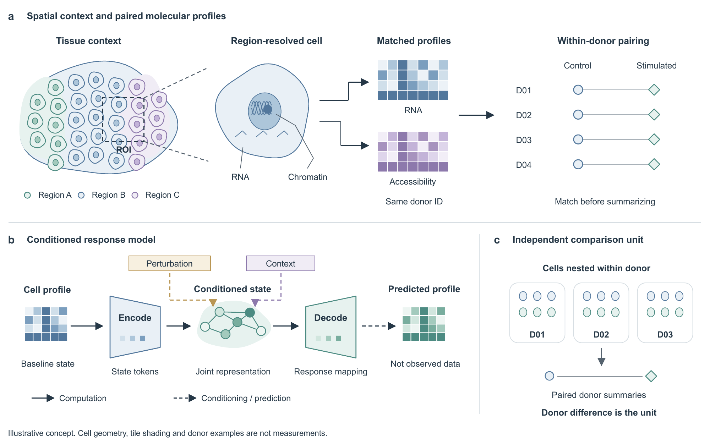
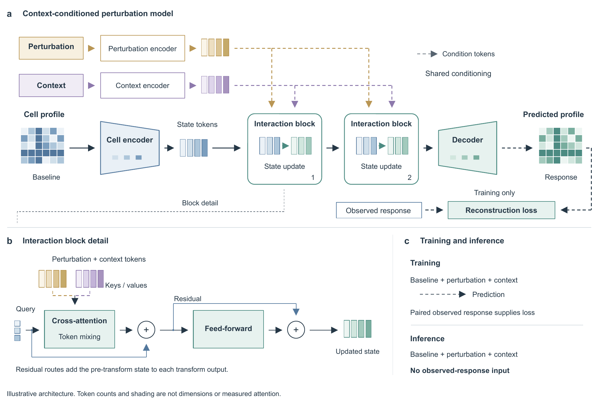
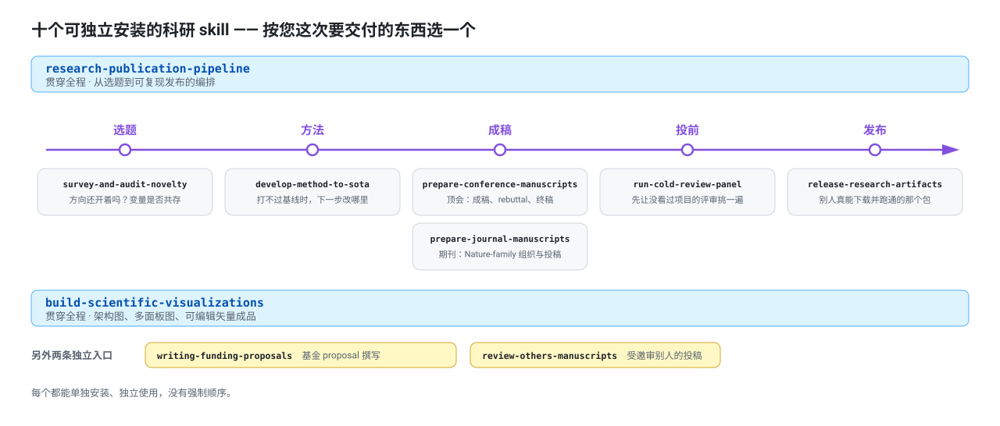
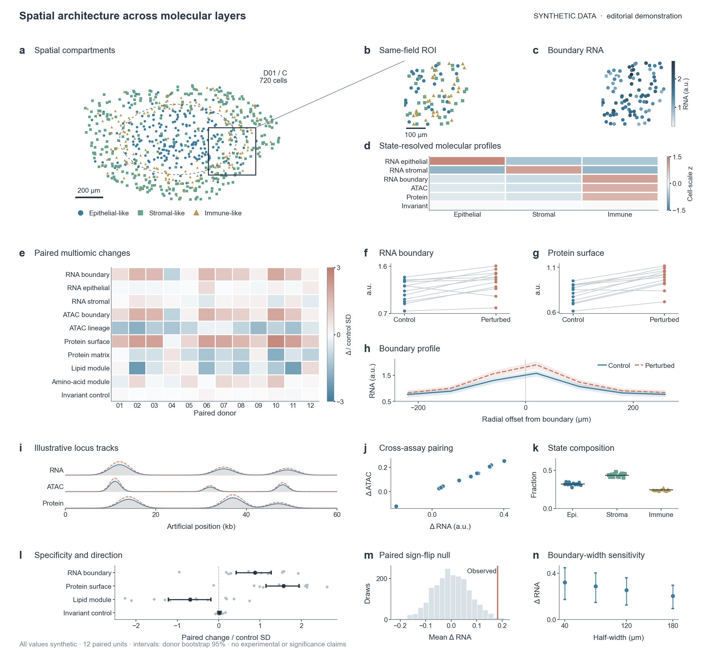

<div align="center">

<picture>
  <source media="(prefers-color-scheme: dark)" srcset="assets/branding/open-research-skills-logo-dark.png" />
  
</picture>

# Open Research Skills

### 让科研材料成为清楚的论证、可编辑的图件和可复用的成果。

科研绘图 · 顶会论文 · 期刊论文 · 基金 proposal · 科研全流程

[选择 skill](#choose) · [专项任务与打磨](#tasks) · [快速开始](#start) · [绘图](#visualization) · [会议论文](#conference) · [期刊论文](#journal) · [基金](#funding) · [研究工作流](#workflow) · [对照评测](#evidence)

**中文** · [English](README.en.md) · [](https://github.com/gxCaesar/open-research-skills/actions/workflows/checks.yml) [](https://github.com/gxCaesar/open-research-skills/releases/latest) [](https://github.com/gxCaesar/open-research-skills/blob/main/.github/workflows/checks.yml) [](https://github.com/gxCaesar/open-research-skills/blob/main/LICENSE)

</div>

这是一个面向日常科研的 agent skill 工具箱。十个完整 skill 在一个仓库中维护，每个都能单独安装、独立使用。你可以从一张图、一段 Results 或一个研究问题开始，不必先启动整套研究流程。

## 两行装上

**Claude Code** —— 十个一次装齐，装完用 `/open-research-skills:<skill-name>` 调用：

```bash
claude plugin marketplace add gxCaesar/open-research-skills
claude plugin install open-research-skills@open-research-skills
```

**Codex**（`$HOME/.agents/skills/` 也是 Antigravity CLI 的项目级目录名）：

```bash
git clone https://github.com/gxCaesar/open-research-skills.git
cd open-research-skills && bash scripts/install_skills.sh "$HOME/.agents/skills"
```

只装其中一两个、或换其他 runtime，见[快速开始](#start)。

## 装上之后能得到什么

<div align="center">


</div>

左：Nature 风格机制图。右：顶会风格模型架构图。**两张都是原生可编辑的 PPTX 与矢量 PDF，不是位图截图** ——
标签、配色、模块位置都能直接改。
[机制图 PPTX](skills/build-scientific-visualizations/examples/advanced-method-diagrams/nature-spatial-mechanism.pptx) ·
[架构图 PPTX](skills/build-scientific-visualizations/examples/advanced-method-diagrams/conference-conditioning-architecture.pptx) ·
[怎么改它们](skills/build-scientific-visualizations/examples/advanced-method-diagrams/README.md)

一次真实调用长这样：

```text
使用 build-scientific-visualizations。按 notes/method.md 画方法架构图，
两栏宽，导出可编辑 PPTX 和矢量 PDF。
```

论文、基金和整条研究流程同理：说清材料在哪、这次要交付什么、允许改到什么程度。

<a id="choose"></a>

## 选择你这次需要的 skill

<div align="center">
<picture>
  <source media="(prefers-color-scheme: dark)" srcset="assets/overview/skill-map-zh-dark.svg" />
  
</picture>
</div>

| 你现在的任务 | 入口 | 典型交付 |
|---|---|---|
| 把方法、机制或多组学结果画清楚 | [科研绘图](#visualization) | 可编辑架构图、多面板图、矢量文件与 legend |
| 从材料成稿，或修改顶会论文 | [会议论文](#conference) | 论文与附录、结果论证、rebuttal、camera-ready |
| 组织期刊论文与投稿、修回材料 | [期刊论文](#journal) | 稿件、图注、数据声明、cover letter、审稿回复 |
| 准备研究基金申请材料 | [基金 proposal](#funding) | 科学问题、证据需求、研究内容、章节 brief、审阅建议 |
| 判断课题并推进实验、成稿与交付 | [研究工作流](#workflow) | 可行性判断、比较结果、下一步实验与复现材料 |

按**本次要交付的东西**选择即可。论文 skill 能独立处理论文需要的图件，研究工作流能独立组织成稿；专门的绘图 skill 提供更丰富的设计支持，但不是其他四个的强制依赖。

教程以 AI 与生物研究为主，覆盖单细胞、扰动预测和空间多组学；组织材料、科学写作和交付方法也可迁移到其他领域。下文说明十项能力怎样用于真实科研，十份独立中文手册进一步展开材料准备、逐阶段操作、调用示例和交付检查。绘图提供可编辑成品；小型教学脚本作为可选练习，不代表完整科研能力或真实实验效果。

<a id="tasks"></a>

## 专项任务与打磨：不用从完整流程开始

下面都是这十个 skill 内的任务入口，不需要另装同名的小 skill。调用时说明材料位置、目标与允许修改的范围。

| 这次只想做什么 | 使用入口与操作说明 | 主要交付 |
|---|---|---|
| 检查标题、起草或压缩摘要 | 会议或期刊 skill 的摘要组件：[会议](skills/prepare-conference-manuscripts/components/abstract/guide.md)／[期刊](skills/prepare-journal-manuscripts/components/abstract/guide.md) | 标题建议、摘要或只读诊断，按适用要求核对字数与主张 |
| 打磨一节，或继续下一节 | `polish`：[会议逐节流程](docs/conference-manuscripts.md#section-polish)／[期刊逐节流程](docs/journal-manuscripts.md#section-polish) | 本节修订、实际检查结果、完成状态与下一节位置 |
| 审查并打磨全文、整理终稿 | [会议全稿流程](skills/prepare-conference-manuscripts/references/full-paper-workflow.md)／[期刊修订与交付](docs/journal-manuscripts.md) | 范围内完整修订、跨文件核对、可阅读稿与本地候选包 |
| 只审稿，不改原文 | 会议或期刊 skill 的 `audit`：[会议](skills/prepare-conference-manuscripts/references/adversarial-audit.md)／[期刊](skills/prepare-journal-manuscripts/references/adversarial-audit.md) | 有位置、证据、影响和最小修正建议的问题清单 |
| 核查统计表述、图注与引用 | 会议或期刊 skill，明确指定这些材料 | 来源与分母核对、表述修订或待解决问题，不重新选择分析 |
| 精修已有图件 | 绘图 skill 的[局部修改与精修](docs/scientific-visualizations.md#refinement) | 可编辑修订、前后渲染比较与所需导出 |
| 深读一篇论文 | 工作流 `survey` 的[单篇深读](docs/research-publication-workflow.md#paper-reading) | 问题、方法、实验、证据位置和限制的 Paper Card |
| 打不过基线，决定下一步改哪里 | [方法迭代到 SOTA](docs/method-development.md) | 实测 headroom 与噪声底、误差分层表、一次一个组件加可 void 对照的结果 |
| 判断一个方向还开不开着 | [调研与新颖性审计](docs/survey-and-novelty.md) | 贡献车道、变量共存计数表、分开记录的撞车／可行性／venue 判词与击杀层 |
| 投稿前让没看过项目的人挑毛病 | [冷审 panel](docs/cold-review-panel.md) | 可核验的隔离清单、逐视角发现、真跑过 artifact 的记录与裁决排序 |
| 受邀评审别人的投稿 | [受邀审稿](docs/peer-review.md) | 保密边界判断、编辑可执行的意见、严重度标定与返修轮对齐表 |
| 打一个匿名或可引用的代码数据包 | [代码与数据发布](docs/artifact-release.md) | 白名单文件清单、暂存树身份扫描、成品包内的验证运行记录 |
| 从一组论文学习写作与图件组织 | 工作流 `survey` 的[论文集合分析](docs/research-publication-workflow.md#exemplar-corpus) | 带出处的 Results 组织、图序、图注与主补安排观察 |
| 审阅基金原稿或组织研究方案 | [基金 proposal 手册](docs/research-funding-proposals.md) | 论证问题、带注释的章节 brief、政策允许范围内的图件协助 |

**单节、逐节与全文任务的边界不同。** “只改 Results”到该节完成为止；“继续下一节”先读取已有进度和当前稿件；明确要求逐节完成全文时，可以在授权范围内连续推进。单节检查通过不等于整稿完成，全部目标章节完成后还需核对跨节与主补材料的一致性。只读审查不自动转成修改。

<a id="start"></a>

## 快速开始

### 1. 获取仓库，找到本次任务的手册

```bash
git clone https://github.com/gxCaesar/open-research-skills.git
cd open-research-skills
```

不想先配置 agent？可以先阅读手册或打开成品：

- 想看图件：[空间多组学复合图](skills/build-scientific-visualizations/examples/spatial-multiomics-atlas/README.md)。
- 想写论文：[会议论文使用手册](docs/conference-manuscripts.md)或[期刊论文使用手册](docs/journal-manuscripts.md)。
- 想推进课题：[从研究问题到发表的完整手册](docs/research-publication-workflow.md)。
- 想立即运行：[扰动预测教学比较](skills/research-publication-pipeline/examples/perturbation-comparison/README.md)，只需 Python 标准库。

### 2. 安装一个完整 skill

下面用绘图 skill 和仓库旁的 `research-demo` 练习项目演示。在仓库根目录执行；已有科研项目时，将 `RESEARCH_PROJECT` 改为那个项目的实际路径。

```bash
RESEARCH_PROJECT="$PWD/../research-demo"
SKILL_NAME=build-scientific-visualizations
SKILL_DEST="$RESEARCH_PROJECT/.agents/skills"
mkdir -p "$SKILL_DEST"

if test -e "$SKILL_DEST/$SKILL_NAME" || test -L "$SKILL_DEST/$SKILL_NAME"; then
  echo "目标已存在，未覆盖；请先保留并比较本地修改。"
else
  cp -R "skills/$SKILL_NAME" "$SKILL_DEST/"
fi
test -f "$SKILL_DEST/$SKILL_NAME/SKILL.md"
```

上面是 **Codex 与 Antigravity CLI 的项目级安装** —— `.agents/skills/` 是这两个 runtime 共用的
项目级目录名，一份拷贝两边都读得到。（**全局级不共用**：Codex 是 `$HOME/.agents/skills/`，
Antigravity CLI 是 `$HOME/.gemini/antigravity-cli/skills/`。）使用 Claude Code 时，把 `SKILL_DEST` 那行换成
`SKILL_DEST="$RESEARCH_PROJECT/.claude/skills"`，再执行后面的复制步骤。

**Claude Code 可以两行装齐十个**，不必逐个复制目录：

```bash
claude plugin marketplace add gxCaesar/open-research-skills
claude plugin install open-research-skills@open-research-skills
```

仓库同时是 marketplace 和 plugin 本身，所以两条命令指向同一个名字。

**装完怎么调用。** 插件安装的 skill 是**带命名空间**的，形式为 `/open-research-skills:<skill-name>`，
例如 `/open-research-skills:build-scientific-visualizations`。命名空间不是装饰：它意味着
**即使你自己的 `$HOME/.claude/skills/` 里已经有同名 skill，两个也会同时加载、互不覆盖** ——
不必为了装这个仓库去改名或删掉你自己的那份。直接用自然语言点名 skill 同样有效。

### 3. 各 runtime 的安装与更新

| Runtime | 安装 | 更新 |
|---|---|---|
| **Claude Code**（插件，推荐） | 上面两行 | `claude plugin marketplace update open-research-skills`，再 `claude plugin update open-research-skills@open-research-skills`（需重启生效） |
| **Claude Code**（只装其中一两个） | 复制到 `.claude/skills/` 或 `$HOME/.claude/skills/` | `git pull` 后重新复制 |
| **Codex** | 复制到 `.agents/skills/` 或 `$HOME/.agents/skills/` | `git pull` 后重新复制 |
| **Antigravity CLI**（`agy`，Gemini CLI 的继任者） | 项目级同上 `.agents/skills/`；全局级复制到 `$HOME/.gemini/antigravity-cli/skills/` | `git pull` 后重新复制 |
| **其他 runtime**（含由 DeepSeek 等模型驱动的 harness） | 每个 skill 都是自足目录：把 `skills/<name>/` 整个复制到该 harness 读取 skill 或项目上下文的位置。支持 Anthropic 式 skill 的会直接读 `SKILL.md` | `git pull` 后重新复制 |

最后一行**故意不给具体命令**：这类 harness 的加载位置各不相同，本仓库没有逐一验证过。
一条没验证过的安装命令比不给更糟。

| 使用范围 | Codex | Antigravity CLI (`agy`) | Claude Code |
|---|---|---|---|
| 当前科研项目 | 项目内 `.agents/skills/` | 同左，`.agents/skills/` | 项目内 `.claude/skills/` |
| 所有本地项目 | `$HOME/.agents/skills/` | `$HOME/.gemini/antigravity-cli/skills/` | `$HOME/.claude/skills/` |

个人级安装只需将 `SKILL_DEST` 设为表中的对应目录。只复制完整的 `skills/<skill-name>/`，不要仅复制 `SKILL.md`，也不要再套一层同名目录。安装全部时，对十个名称分别执行同样的复制步骤。更新前保留自己的修改，不要直接覆盖。

路径与发现方式核对于 2026-09-09，参见 [Codex 官方说明](https://developers.openai.com/codex/skills)与 [Claude Code 官方说明](https://code.claude.com/docs/en/skills)。其他兼容 runtime 使用其自身的目录与发现机制；本仓库不配置账号或模型服务。

### 3. 在科研项目中调用

在 `research-demo` 或你的科研项目中打开 agent，并确认 skill 已出现在可用列表里。Codex CLI / IDE 使用 `$skill-name`；Claude Code 复制目录安装时是 `/skill-name`，
**按插件安装时是 `/open-research-skills:skill-name`**；Antigravity CLI 会把发现到的 skill
自动编译成斜杠命令。
也可以自然语言明确要求使用该 skill。

例如在 Codex 对话中输入：

```text
$build-scientific-visualizations
根据 methods.md 中的扰动预测方法，画出模型总览和交互模块展开图。
保留训练与推理边界，交付可编辑 PPTX、矢量 PDF 和 SVG。
```

将第一行替换为 `/build-scientific-visualizations` 即为显式调用形式；**按插件装进 Claude Code 时是
`/open-research-skills:build-scientific-visualizations`**，前缀来自命名空间，也正是它让同名的
个人 skill 与本仓库的那份能共存。这是**对话输入，不是 shell 命令**。文件名要换成你实际提供的材料；发现不到新 skill 时，先检查目录层级，再重启对应 runtime。

### 4. 按任务准备依赖

阅读与标准库教学比较无需安装第三方包。绘图等脚本使用各 skill 自己的 `requirements.txt`；在仓库根目录可这样准备环境：

```bash
python3 -m venv .venv
source .venv/bin/activate
python3 -m pip install -r skills/build-scientific-visualizations/requirements.txt
```

本文 shell 示例面向 macOS/Linux 的 bash/zsh，Python 3.9 或以上。Windows 请用对应 shell 的环境激活与变量语法。字体、Poppler、TeX、Office 渲染器及图像模型不是这些 Python 依赖的一部分，完整需求见各教程。

<a id="visualization"></a>

## 01 · 科研绘图

`build-scientific-visualizations` 将科学对象、方法关系和源数据组织为可读图件。适合单张机制图或架构图、一张密集复合图，以及 main / Extended Data / Supplementary 整套图。

**带上什么：** 方法说明或论文段落、数据表与已有绘图代码、独立样本与配对关系、目标宽度或版面要求。

**得到什么：** 图件、可编辑源文件、所需矢量导出、legend 与源数据说明。

> **新画机制图 / 架构图的默认路线需要能生成概念图的界面。** 这条路线是
> **GPT Image 2.5 生成概念 → 复刻为原生可编辑 PPTX → 比对真实渲染并测试可编辑性**，
> 生成那一步目前要在暴露该模型的界面里做，实践中是 **Codex**。
> Claude Code 侧可以完成这条路线的其余全部步骤 —— 内容与判据的锁定、样式选择、
> 复刻为原生对象、渲染比对、以及可编辑性检查。
> 没有那个界面时，skill 本身写明了两条替代路径：**用你自己提供的概念图**，
> 或**直接走矢量工作流**（`references/image-concept-to-vector.md`）。
> 用数据画的图（定量图、结构、显微）本来就不走这条路线，它们来自源数据或原始图像。

### 案例 A：从空间多组学表格到 14-panel 复合图



空间锚图建立位置关系，同源 ROI 与 RNA 层承接局部观察，donor × assay 热图和配对图组织比较，后续面板补充组成、null 与敏感性。画布为 183 × 170 mm；12 个 donor 标识与 17,280 个 cell 坐标均为合成数据，不是显微图或真实研究结论。

在已准备绘图依赖的环境中，从仓库根目录运行：

```bash
SKILL_DIR="$PWD/skills/build-scientific-visualizations"
DEMO_OUT=$(mktemp -d)
MPLCONFIGDIR="$DEMO_OUT/.mpl" XDG_CACHE_HOME="$DEMO_OUT/.cache" \
  python3 -B "$SKILL_DIR/examples/spatial-multiomics-atlas/render.py" \
  --output "$DEMO_OUT/atlas"
```

实际生成 `spatial-multiomics-atlas.pdf`、`.svg` 和 `.png`；这个数据图例不生成 PPTX。

[完整情境与重绘教程](skills/build-scientific-visualizations/examples/spatial-multiomics-atlas/README.md) · [PDF](skills/build-scientific-visualizations/examples/spatial-multiomics-atlas/preview/spatial-multiomics-atlas.pdf) · [SVG](skills/build-scientific-visualizations/examples/spatial-multiomics-atlas/preview/spatial-multiomics-atlas.svg) · [源数据](skills/build-scientific-visualizations/examples/spatial-multiomics-atlas/data) · [Legend](skills/build-scientific-visualizations/examples/spatial-multiomics-atlas/legend.md)

### 案例 B：从方法说明到可编辑架构图


模型图分开 baseline state、perturbation 和 context，并展开 attention 与残差计算。另一张 Nature-inspired 图用组织、细胞、配对分子层和 donor 层级解释采样关系。两张都是虚构教学设计，文字、形状和连线在 PPTX 中可分别编辑。

[模型图 PPTX](skills/build-scientific-visualizations/examples/advanced-method-diagrams/conference-conditioning-architecture.pptx) · [模型图 PDF](skills/build-scientific-visualizations/examples/advanced-method-diagrams/conference-conditioning-architecture.pdf) · [空间机制图预览与编辑教程](skills/build-scientific-visualizations/examples/advanced-method-diagrams/README.md) · [空间机制图 PPTX](skills/build-scientific-visualizations/examples/advanced-method-diagrams/nature-spatial-mechanism.pptx)

新建或重设计示意图的默认方法是：**参考优秀构图 → GPT Image 2.5 概念稿 → 重建原生可编辑矢量 PPTX → 检查实际渲染。** 数据图与测量图像仍从原始材料绘制。当前图像工具若不公开后端版本，应报告版本未核实，不能把示例当成指定版本的运行认证。

已有首稿后，可以按整体构图、局部科学图元、最终尺寸协调进行[分层精修](docs/scientific-visualizations.md#refinement)，保留前后版本并比较实际渲染。只移动标签或调整局部布局时，可直接修改源文件，不必重新生成整张概念稿。

```text
使用 build-scientific-visualizations。
根据 methods.md 和目前的 Figure 1，重设计模型总览与关键模块展开。
保留符号、箭头含义和训练/推理边界，使用默认概念稿到原生 PPTX 的路线。
交付可编辑 PPTX、矢量 PDF/SVG、图注；结果面板从 figures/data/ 重绘。
```

[完整中文使用教程](docs/scientific-visualizations.md) · [18-panel 进阶案例](skills/build-scientific-visualizations/examples/multimodal-18-panel/README.md) · [两种风格与六套配色](skills/build-scientific-visualizations/references/diagram-style-profiles.md)

<a id="conference"></a>

## 02 · 会议论文

`prepare-conference-manuscripts` 面向 **AAAI、ICLR、ACL、CVPR、ICML、NeurIPS** 等计算机学术会议。它处理从已有研究材料成稿、全文修改、附录和补充材料，到 rebuttal、camera-ready 与本地提交包的作者侧工作。重点是让问题、方法、比较和结论互相支撑，不只是换模板或润色英语。

### 先确定投哪里、现在处于哪一步

告诉 agent 准确的 **venue / year / track / stage**。同一会议的主会、workshop、不同 track 和年份不能共用未经核对的规则。仓库自带六个会议适配器，但其中的 profile 有明确日期；实际写作仍需核对目标范围的当前官方要求。其他会议可以建立任务内 profile，不需要修改已有适配器。

| 你现在的状态 | 使用方式 | 主要交付 |
|---|---|---|
| 尚未确认目标规则 | `recon` | 当前模板、阶段要求、适用政策与尚未确认事项 |
| 已有方法和结果，还没有完整稿 | `draft` | 问题与贡献界定、章节提纲、证据支持的英文稿件 |
| 已有初稿，需要改结构和表达 | `polish` | 有针对性的修订稿、关键修改说明 |
| 想先判断稿件有什么问题 | `audit` | 带原文位置、证据和最小修正建议的只读报告 |
| 收到评审或进入讨论 | `rebuttal` | 逐点回复、证据对应、同步修订位置 |
| 录用或准备最终上传材料 | `camera-ready` / `package` | 对齐当前要求的源码、PDF、附录与本地候选包 |

这些是对话中的任务模式，不是七个 shell 命令。可以直接描述工作，agent 会选择对应模式；一次请求也可以覆盖成稿到打包的连贯任务。

### 从材料到一篇能读懂的方法论文

准备当前稿件或提纲、方法定义、数据与 split、baseline 配置、原始结果表、图表源码和文献。先明确论文要回答什么问题，现有方法具体在哪个条件下不足，你改变了哪个运算或机制，以及哪些实验能区分这个解释。

成稿时，Introduction 建立问题与缺口，Method 解释问题如何转化为方法设计，Experiments 给出公平比较和机制证据，Discussion / Limitations 界定适用范围。摘要在主张和证据稳定后压缩。章节名称与顺序服从论文和目标会议，不套固定模板。

```text
使用 prepare-conference-manuscripts，目标为 ICLR 2027 Main Conference 初次投稿。
先核对这一范围的当前官方要求，再阅读 methods.md、experiments/、references.bib
和 draft.tex。中心问题是跨细胞环境的扰动预测；科学协议以 experiment-notes.md 为准。
整理研究问题—方法操作—比较证据的对应关系，完成全文与附录的结构修订。
保留所有数值、baseline、数据划分和不利结果，缺证据的位置明确列出。
图件需要修改时从给定源数据或方法说明制作，检查实际编译的 PDF。
交付修订源码、可阅读 PDF、关键修改说明和尚未解决的问题，不代为提交。
```

如果只修改摘要、Method 或某一节，在请求中缩小范围即可。全文任务则不止返回一个摘要或审阅清单；应覆盖已提供的全部章节，并指出尚缺哪些内容。

需要逐节推进时，使用[逐节打磨与续接](docs/conference-manuscripts.md#section-polish)：先确定章节顺序与可写版本，再完成本节的论证、来源和受影响编译检查，将状态与下一节记入已有项目记录。“继续下一节”会核对当前文件，不凭旧的完成标记跳过尚未验证的修改。

### Rebuttal 与终稿怎样接上

提供完整评审、提交版本和已完成的新分析。先区分事实误解、表达问题、证据缺口与合理限制，再逐点回答。每个“已补充”都应指向实际结果和改动位置；尚未运行的实验不能写成已经解决。终稿阶段继续核对回复承诺、正文、图注、附录和代码说明是否一致。

```text
使用 prepare-conference-manuscripts 的 rebuttal 模式。
读取 reviews.md、提交版本和 revision-results/，按评审意见逐点组织回复。
说明哪些问题已由现有证据解决，哪些只能澄清或承认限制。
将每条回复对应到修订稿位置，保留尚未完成的事项，不发布回复。
```

**详细手册：** [六个会议如何适配、各章节如何推进、全文修改、rebuttal、camera-ready 与提交检查](docs/conference-manuscripts.md)。手册包含分阶段调用范例与材料清单；小型检查器练习放在末尾，不作为论文能力的主要展示。

<a id="journal"></a>

## 03 · 期刊论文

`prepare-journal-manuscripts` 面向期刊全文、图注、统计与数据报告、编辑沟通和修回。包含 Nature-family 的章节写作与已发表文章观察，也能按其他期刊的当前指南开展工作。Nature、Nature Methods、Nature Biotechnology、Nature Communications 等刊物并不是同一套文章要求，必须明确具体期刊、文章类型和阶段。

### 材料准备：全文之外还需要什么

提供科学问题、已有稿件、方法与结果来源、样本层级、图表和 legend，以及伦理、数据、代码与其他声明的已知事实。细胞数、donor 数、组织切片数、技术重复和模型 seed 要分别说明；多个面板可能来自同一批样本，不能把面板数量当成新增独立证据。

| 工作阶段 | Skill 怎样帮助 | 你应收到什么 |
|---|---|---|
| 期刊与文章类型核对 | `recon` 区分目标刊要求、出版方通则和文章先例 | 适用要求及缺项，不是泛化的“Nature 模板” |
| 先审查，暂不修改 | `audit` 核查证据、统计、引用与跨文件一致性 | 带原文位置与修正建议的只读报告 |
| 全文起草与修订 | `draft` / `polish` 建立证据顺序与段落工作 | 任务范围内完整稿件、修改说明 |
| 主图、扩展与补充材料 | 统一科学对象、样本定义、正文引用和图注 | 可读图件、完整 legend、相互一致的补充材料 |
| 统计与数据报告 | 表达实际分析、独立单位、限制和访问路径 | 准确的统计报告、Data / Code Availability |
| 投稿准备 | `editor-pack` / `cover-letter` 整理编辑需要的信息 | Cover letter、声明及本地材料包 |
| 修回与录用后交付 | `revision-response` / `final-package` 同步所有改动 | 逐点回复、clean / marked 稿件及更新附件 |

### 全文如何形成科学论证

Results 按问题和证据的推进顺序组织，而不是按实验发生的时间流水记账。Methods 提供理解与重现比较所需的条件；Discussion 区分直接观察、作者解释和更广泛意义。主图承担核心论证，补充材料承接必要细节与稳健性，不能把决定结论是否成立的限制藏到补充里。

已有初稿可按[逐节打磨与续接](docs/journal-manuscripts.md#section-polish)处理 Introduction、Results、Methods、Discussion、摘要和 legends。每节采用其实际写作任务与证据要求，保留当前进度；整篇完成时再统一检查术语、数值、图文与主补关系。

```text
使用 prepare-journal-manuscripts，目标为 Nature Methods 的 Article 初稿。
核对当前文章类型要求，阅读 manuscript.md、methods/、results/、figures/
与 data-inventory.md。围绕作者已经确定的科学问题组织全文。
先梳理各节和主图分别回答什么，再修订 Introduction、Results、Methods、
Discussion、摘要与 legends；主文、扩展和补充保持同一个样本与分析定义。
保留实际统计量和限制，不扩大因果范围，不把待验证内容写成发现。
交付完整工作稿、图注和必要的稿件图件、可阅读版本及简短缺项说明。
```

### 数据声明、Cover letter 与修回

数据声明从实际数据清单写起：哪些材料支撑结论、已在哪里可访问、哪些受限、由谁管理和怎样申请。未取得 accession、DOI、作者确认或伦理信息时保留缺项，不制造已经公开或已经获批的印象。Cover letter 说明工作做了什么、证据是什么、为何适合这本期刊，不承诺未经检索证明的“首次”。

```text
使用 prepare-journal-manuscripts 的 revision-response 模式。
读取编辑决定、完整审稿意见、上一版稿件和已完成的补充分析。
逐点区分已修改、已澄清、证据仍不足和有依据的不同意见。
同步回复信、clean manuscript、marked manuscript、图件和补充材料，
核对每个修改位置以及 Data / Code Availability。未运行分析明确保留。
```

**详细手册：** [期刊定位、各章节写法、图文与统计协调、投稿材料、逐点修回及最终交付](docs/journal-manuscripts.md)。这项 skill 可以独立完成稿件范围的图件和编辑材料，不要求先安装另外四项；新实验设计和实际投稿另行明确任务。

<a id="funding"></a>

## 04 · 基金 proposal

`writing-funding-proposals` 面向科研基金 proposal 的撰写，协助组织研究论证与申请材料，主要覆盖 NSFC 与省级基金。安装与调用名称保持不变。随包提供 NSFC 与广东的有日期参考；其他省份和其他基金按各自当年指南适配，不代表都有预置模板或适用相同政策。

### 从申报指南与申请人材料开始

至少说明资助方、年度、项目类别和申请阶段，并提供正式指南、申请系统提纲、机构要求与申请人自己的研究积累。项目期限、预算口径、资格、限项和 AI 辅助政策以这次申请的当前来源为准，不能从另一年度或另一类项目复制。

Skill 会先界定允许的协助范围，再处理科学问题和材料。若政策限制生成可提交正文，仍可在允许范围内完成公开文献整理、论证结构、证据缺口、章节 brief 和申请人原稿审阅；不能把“润色”当作规避政策的名称。

### 各部分怎样协同

| 申请内容 | 具体要解决的问题 |
|---|---|
| 选题与科学问题 | 研究对象是什么；哪种关系、机制或限制尚未被解释；怎样验证 |
| 立项依据 | 已知证据怎样导向这个缺口，为什么现有方案不足，项目为何值得做 |
| 研究内容与目标 | 每项内容回答哪个子问题，与总问题怎样形成递进关系 |
| 研究方案与技术路线 | 数据、方法、对照、评价和验证怎样配合，而非列一串模型名 |
| 创新点 | 新在哪里，改变了什么认识或能力，有何证据支持预期差异 |
| 前期基础与可行性 | 哪些条件已具备，哪些只是计划，申请人经验能支撑哪一步 |
| 年度计划与风险 | 按真实依赖安排里程碑，负向结果和数据不足时怎样继续回答问题 |
| 经费与提交检查 | 在实际资助规则及机构口径下检查一致性，不凭空给出额度 |

不强迫每个项目拆成同样数量的研究内容。每个子任务都需要清楚的输入、方法、可观察结果和与总问题的关系；独立验证应体现在研究设计中，而不只写成结尾一句“验证有效性”。

```text
使用 writing-funding-proposals，协助准备 NSFC 申请材料。
阅读本年度指南、项目类别说明、系统提纲、research-notes.md 和我已有的原稿。
先核对适用要求和 AI 辅助边界，再梳理一个中心科学问题及其证据缺口。
将立项依据、研究内容、研究方案和前期基础对应起来，检查是否出现
“问题没有对应实验”“创新点没有对照”或“计划冒充已有结果”。
在政策允许范围内交付带注释的章节 brief、原稿审阅建议、技术路线说明
与年度安排。预算只使用我提供的规则与事实，不虚构论文、平台和合作基础。
```

准备省级基金时，提供准确省份、年度、项目类别、正式指南与机构要求；广东使用相应路由，其他省份自定义适配，需要运行本地初始化工具时使用 `--program other`。原有研究证据可复用，但类别定位、栏目、期限和经费要求必须重新匹配，不能直接套用 NSFC 或广东的规则。

已有一版申请书时，可以只请求“立项依据审阅”“研究内容重组”或“技术路线图制作”。图形辅助须单独核对资助方与机构要求，文字辅助许可不等于图形许可；未核实时仅做图示 brief 或现有图审阅，私人及受限材料不发送到外部图像服务。

**详细手册：** [基金 proposal 的准备方式、科学问题到章节、年度与风险、政策边界和提交前检查](docs/research-funding-proposals.md)。另附[细胞扰动研究的带注释章节 brief](skills/writing-funding-proposals/examples/section-brief-walkthrough.md)，用于理解论证组织，不是可直接提交的申请书。

<a id="workflow"></a>

## 05 · 科研全流程：从问题到发表

`research-publication-pipeline` 用于启动或续接一个真实研究项目：选题与文献调研、数据可行性、新颖性、基线与提升空间、小试、方法开发、正式实验、结果解释、论文和可复现代码。默认面向 top-CS 与 Nature-family 的证据要求，也可按项目明确的目标调整。它不是把几条脚本顺序运行完就宣称研究完成。

### 从哪里进入

如果只有方向，先做 `survey` 和 `plan`；已有数据与问题时进入 `pilot`；已有公平 baseline 时进入 `develop`。实验正在运行可以只用 `monitor`，结果已定可以直接做 `claim-lock` 或 `manuscript`。**已有项目先读当前状态与真实输出，不从头重做调研，也不把旧计划当成已完成实验。**

研究贡献分为 `sota-method`、`discovery` 和 `benchmark`。三者的核心证据不同：方法需要匹配协议下的有效改进，发现需要新认识及独立验证，benchmark 需要明确的资源或评价缺口。方法困难不应悄悄变成 benchmark 项目。

`survey` 也可独立用于[单篇 Paper Card](docs/research-publication-workflow.md#paper-reading)，或[从指定论文集合学习写作与图件组织](docs/research-publication-workflow.md#exemplar-corpus)，不必启动实验项目。例如：

```text
使用 research-publication-pipeline 的 survey 模式，分析 papers/ 中同类型的论文。
这次只学习 Results 的证据顺序、主图与补充的分工和图注如何解释样本。
记录实际读到的章节、页码或面板，区分共同观察、例外和未读材料。
给出对当前稿件可借鉴的组织方式，不复制文字、图件或把文章先例当作官方规则。
```

### 1. 把方向变成可检验问题

从研究对象、输入输出、独立样本和目标使用场景开始。对于 AI-for-biology，尤其需要确认所谓“跨环境”“未见扰动”或“机制发现”究竟对应什么泛化对象。文献阅读比较任务、数据、表示、split 和评价定义，不只比较方法名称。

这一阶段分别给出三个判断：**数据是否可做、新颖性证据是什么、贡献是否适合目标 venue**。相邻工作可以限定贡献差异，不等于已经完全重复；没有找到数据也不等于证明数据不存在。

```text
使用 research-publication-pipeline，从选题阶段开始。
方向是利用公开单细胞扰动数据研究跨细胞环境的响应预测。
阅读 topic-notes.md，检索并打开当前一手论文与数据说明，比较准确任务与贡献。
分别说明数据可行性、新颖性和目标 venue 匹配度，列出证据及尚未核实的部分。
优先形成一个能被小规模真实数据检验的问题，不先设计复杂架构。
```

### 2. 核实数据与可测提升空间

先检查研究需要的变量是否在同一批可关联样本中共存，再检查访问条件、数据版本、分组与潜在泄漏。细胞很多但 donor 很少，不能按细胞数量估计独立验证强度；多个数据集名字相似，也不代表样本可直接配对。

建立最强的适用、可复现比较：不仅有常用模型，还要考虑真正针对任务的便宜基线、同信息量对照和合理的 train-only 组合。测量噪声与实现差异后，判断是否还有足以支撑研究的提升空间。报告应说清楚比较对象、评价单位和观察结果，而不是只给“值得做”的判断。

### 3. 用小试决定下一步方法开发

`pilot` 选择最能检验关键前提的小规模真实数据实验。`plan` / `freeze` 明确数据划分、主指标、候选选择、校准方式和最终测试边界。小试成功代表相关前提获得支持，不代表已经达到 SOTA 或具备发表结论。

方法开发依次检查公平复现和训练配方、目标函数、数据与表示、组合方法、测试时计算，最后再考虑更复杂架构。每次改变要有可识别的机制，配套一个保留其他条件的对照；不要同时更换数据、损失、模型和评价后再把提升归给某个模块。

```text
使用 research-publication-pipeline，续接 baseline 已完成的项目。
读取当前项目状态、baseline 配置、逐样本结果和开发集分析。
先检查公平性、误差单位与可测提升空间，再选择一个有明确预测的机制候选。
说明最小对照、正向/负向/无法区分的结果各意味着什么，以及下一步决定。
在现有授权内完成本地分析和准备；远程运行与最终测试单独列出所需操作。
```

### 4. 正式实验、监控与最终评价

正式实验应继承已经确定的协议和比较，不在看到结果后改主指标、挑 seed 或改变纳入规则。运行前明确实际资源与恢复方式；运行中从日志、有限的有效指标和输出判断进展；完成后检查退出状态与结果文件。一个活跃进程或监控记录不是实验结果。

最终测试只在候选与选择规则确定后进入。若出现 NaN、异常高分、baseline 不匹配或疑似泄漏，保留原始证据并处理协议问题，不继续把可疑结果写进论文。这个公开 skill 提供科学组织与本地工具，不自带远程集群、训练预算或投稿权限。

### 5. 从结果到可信主张

围绕实际独立单位报告差异与不确定性，区分平均提升、适用子群、失败条件和没有完成的验证。负向结果可以排除某个机制，但不能自动证明整个研究方向不成立。若没有可靠优势，应缩小主张、继续已登记的候选，或明确讨论路线变化。

`claim-lock` 将标题、摘要、贡献点与图表逐一对应：哪些得到支持，哪些只支持较窄版本，哪些被反驳，哪些未测试。`handoff` 再把稳定的科学内容转入写作；不能靠润色补足证据。

### 6. 完整成稿与可复现交付

`manuscript` 可以独立组织全文、稿件图件、图注、引用、声明与本地候选包；不是只产生一个交接提纲。会议和期刊 skill 可作为更细的写作协作，但并非强制依赖。

`public-release` 从筛选后的代码树准备清晰 README、依赖、运行命令、小例子、期望输出、数据与预处理说明、许可及限制，并实际检查可运行性。研究工作目录里的私有控制记录和授权材料不属于公开代码包；本地准备完毕也不等于已经上传。

```text
使用 research-publication-pipeline。当前实验已按固定协议完成，结果在 results/。
先核对逐项比较与不确定性，再把主张分为支持、需缩小、反驳与未测试。
在这个范围内完成目标论文的全文、图件与图注，检查可阅读版本。
随后整理可复现 public-release 代码副本，写清依赖、数据入口、运行与期望输出，
用随附小例子进行一次本地复现。不增加未经验证的结论，不上传或代为投稿。
```

**详细手册：** [逐个科研环节的输入、操作、输出、判断与调用范例](docs/research-publication-workflow.md)。希望先熟悉脚本时，可选[配对结果分析练习](skills/research-publication-pipeline/examples/perturbation-comparison/README.md)和[代码打包演练](skills/research-publication-pipeline/examples/README.md)；二者是合成教学材料，不是训练实验或研究结论。

## 研究过程中的五个入口

上面五个 skill 覆盖成稿、图件、基金与整条流程。下面五个覆盖过程里最容易卡住、
而又各自独立成任务的环节，同样可以单独安装、单独使用。

| Skill | 什么时候用 | 详细手册 |
|---|---|---|
| `develop-method-to-sota` | pilot 跑通了但打不过基线，要决定下一步改哪里 | [方法迭代到 SOTA](docs/method-development.md) |
| `survey-and-audit-novelty` | 一个方向值不值得开，有没有被做过，需要的数据是否共存 | [调研与新颖性审计](docs/survey-and-novelty.md) |
| `run-cold-review-panel` | 自己的稿子还没投，想先被没看过项目的人挑一遍 | [冷审 panel](docs/cold-review-panel.md) |
| `review-others-manuscripts` | 受邀审别人的投稿，或处理返修轮与编辑预审 | [受邀审稿](docs/peer-review.md) |
| `release-research-artifacts` | 打别人真会下载的那个代码数据包并验它 | [代码与数据发布](docs/artifact-release.md) |

`run-cold-review-panel` 与 `review-others-manuscripts` 方向相反：前者读的是**你自己**
尚未投出的稿子，后者读的是**别人**交给期刊、对你保密的稿子。两者的约束不同，不要互换。

<a id="evidence"></a>

## 我们对这些 skill 做过对照评测，结果连同缺陷一起公开

**[两案证据全文](docs/evidence.md)**

仓库里的测试与校验规则证明的是**校验器在工作**，不是**用了它论文会更好**。
后者是一个可以被检验的断言，所以我们检验了两次：同一份任务与材料、两个互不知情的执行者、
一个额外拿到被测 skill、端点在开跑之前冻结、跨模型家族盲评。

**两案的主结局都是平局** —— 但这个平局是对着什么测的，比结论本身更要紧：
**对照臂是一个能力很强的通用 agent，在无人提示下自己找出了材料里的全部陷阱。**
这是比"一个没做过同类审计的人"难得多的对照，**所以它不能被读成「对人没用」**，
两案都没有测过人。

可归因的差异是**结构**：判词分开记录、击杀点名死在哪一层、报击杀前先跑一次 repair table。
而第二案里那个结构**被填错了** —— 全文把这一条也写了进去，因为它正好是对"价值在于可审计"
这个读法的反例。

每案 n=1、材料是合成的、两臂都是 agent。**演示一个机制，不估计效应量。**

## 常见问题

**需要一次安装十个吗？** 不需要。每个目录都带自己的指令、脚本、模板、参考与示例。它们可以协作，但没有强制安装顺序。

**打磨流程是否已经整合？** 摘要与标题专项、单节及逐节打磨、全文修订、只读审查和图件精修均有对应入口，见[专项任务表](#tasks)。这是按科研任务整理后的工作方式，不是对旧技能库的逐项完整复制；个人账号、固定模型分工、强制逐节 Git 提交和私有运行设施不随包提供。

**运行 demo 等于调用了 skill 吗？** 不等于。脚本验证的是某个具体软件行为；在 agent 中调用 skill，才会根据你的材料进行分析、写作或制图。可读案例帮助你理解预期产物，不能当作自动生成能力的测试报告。

**会自动训练、改论文或投稿吗？** 取决于你明确交给 agent 的任务与可用能力。示例不会训练模型、购买服务或投稿。对既有稿件、实验协议及外部操作，应按任务授权执行。

**概念图和数据图有什么区别？** 概念图解释对象与关系；数据图报告观察。前者可在允许时采用 AI 辅助构图，后者必须使用真实来源。把概念稿重绘为矢量图不免除 AI 使用披露或期刊政策要求。

**可以直接换 CSV 吗？** 教学 renderer 有固定字段与样本约定，不是任意 CSV 的通用可视化界面。迁移时同时调整数据映射、比较单位、图形与解释，具体见各案例。

**出现预期的 exit 1 怎么办？** 会议和期刊案例包含故意不合格输入，教程标明了原因。先单独执行这些命令，再执行修订后的检查；不要把演示失败当成安装失败。

## 文档、依赖与贡献

首页帮助选择，十份中文指南负责讲清使用，随 skill 分发的案例负责展示具体输入与成品。英文保留在代码、技术术语与英文论文示例中，运行入口和参考文档不作机械翻译。

维护者在仓库根目录运行：

```bash
python3 -B scripts/run_tests.py
python3 -B scripts/check_public_content.py .
```

统一测试入口会分别运行根目录和各个 skill 的测试。测试依赖见 [requirements-test.txt](requirements-test.txt)，普通使用者只需安装任务所需依赖。

每次 push 与 pull request 都会在干净机器上重跑这些检查，**Python 3.9 与 3.13 两条**（见 [checks.yml](.github/workflows/checks.yml)）。3.9 那条是关键：仓库声明的下界从此是被持续检验的，而不是只在维护者机器上成立过。`claude plugin validate . --strict` 是 CI 跑不了的一条（需要 Claude Code CLI），仍需本地执行。

[从哪开始贡献](docs/contributing-start-here.md) · [参与贡献](CONTRIBUTING.md) · [维护者](MAINTAINERS.md) · [第三方说明](THIRD_PARTY.md) · [Apache-2.0 许可证](LICENSE)
