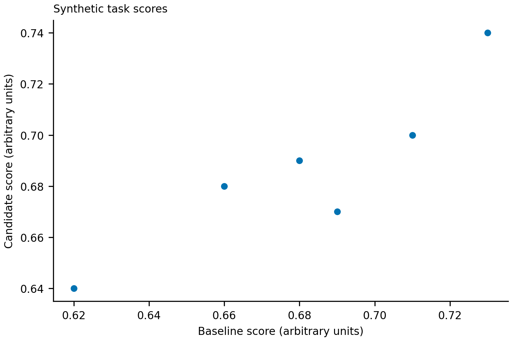

<div align="center">

# Open Research Skills

### 把日常科研中反复做的事，变成可复用的工作方法。

科研绘图 · 会议论文 · 期刊论文 · 中文基金 · 研究到发表

[选择 skill](#五个-skill怎么选) · [图示与案例](#demo-gallery) · [安装](#安装与快速开始) · [使用指南](#日常使用示例) · [测试](#依赖与验证)

</div>

这是一个面向日常科研的 agent skill 工具箱。五个完整 skill 放在一个仓库里，统一文档和维护；每个都可以单独安装、独立完成自己的工作，不需要先装齐其余四个。

它们覆盖从研究问题、实验与结果，到论文、图件、基金和公开代码的常见任务。重点是读懂真实材料、形成清楚的科学论证，并交付能继续修改的产物。仓库包含使用指南、原始教学示例、可编辑图件和可运行的小型 demo，不只是五段简短提示词。

## 五个 skill，怎么选？

| 你现在要做什么 | 选择 | 典型产物 | 详细指南 |
|---|---|---|---|
| 画流程图、模型架构图、机制图，或组织多面板科研图 | `build-scientific-visualizations` | 原生可编辑 PPTX、矢量 PDF/SVG、数据图、figure legend | [科研绘图](docs/scientific-visualizations.md) |
| 写或修改 CS 会议论文，准备 rebuttal / camera-ready | `prepare-conference-manuscripts` | 全文与附录、结果论证、图件、审阅报告、回复与提交材料 | [会议论文](docs/conference-manuscripts.md) |
| 组织期刊论文，准备 cover letter、数据声明和修回 | `prepare-journal-manuscripts` | 稿件、主图与补充材料、统计与数据声明、编辑及审稿人回复 | [期刊论文](docs/journal-manuscripts.md) |
| 准备中文科研基金，梳理选题、依据与技术路线 | `writing-funding-proposals` | 政策与材料清单、科学问题、论证结构、章节提纲和允许的图文材料 | [中文基金](docs/research-funding-proposals.md) |
| 从课题判断推进到实验、成稿与公开代码交付 | `research-publication-pipeline` | 可行性与新颖性判断、实验路线、结果解释、论文与发布材料 | [研究工作流](docs/research-publication-workflow.md) |

按本次要交付的东西选择一个入口即可。写论文的 skill 可以独立完成论文所需的图件；工作流也能独立组织成稿。专门的绘图 skill 提供更丰富的构图与领域图形支持，但不是其他四个的强制依赖。

## Demo gallery

以下都是原始教学示例，不是发表成果或真实研究结论。概念图明确标为示意；数据图来自随附的 synthetic CSV。可以先看预览，再下载可编辑文件或运行示例。

### 01 · 空间多组学：一张完整的 14-panel 复合图

大空间锚图、同源 ROI、连续信号层和 donor × assay 热图组织主要阅读路径，下方保留配对比较、空间 profile、组成、null 和敏感性检查。面板面积随信息任务变化。


[查看完整说明与 legend](skills/build-scientific-visualizations/examples/spatial-multiomics-atlas/README.md) · [PDF](skills/build-scientific-visualizations/examples/spatial-multiomics-atlas/preview/spatial-multiomics-atlas.pdf) · [SVG](skills/build-scientific-visualizations/examples/spatial-multiomics-atlas/preview/spatial-multiomics-atlas.svg) · [输入数据](skills/build-scientific-visualizations/examples/spatial-multiomics-atlas/data)

画布 183 × 170 mm；12 个配对 donor 标识、17,280 个 cell 坐标均为合成数据，不是显微图或实际样本。这个例子演示从表格到矢量图的路径，不声称提供 PPTX。另有 [18-panel 多模态示例](skills/build-scientific-visualizations/examples/multimodal-18-panel/README.md)。

### 02 · Nature-inspired：空间机制与采样层级

用组织区域、细胞轮廓和配对分子层承载科学对象，分开表达方法、采样关系和独立比较单位。


[可编辑 PPTX](skills/build-scientific-visualizations/examples/advanced-method-diagrams/nature-spatial-mechanism.pptx) · [矢量 PDF](skills/build-scientific-visualizations/examples/advanced-method-diagrams/nature-spatial-mechanism.pdf) · [SVG](skills/build-scientific-visualizations/examples/advanced-method-diagrams/nature-spatial-mechanism.svg)

### 03 · Conference-inspired：模型总览与计算模块展开

分开 baseline state、perturbation 和 context 输入；展开交互模块的 query / key / value、attention 与残差计算，并把仅用于训练的观测与推理输入区分开。


[可编辑 PPTX](skills/build-scientific-visualizations/examples/advanced-method-diagrams/conference-conditioning-architecture.pptx) · [矢量 PDF](skills/build-scientific-visualizations/examples/advanced-method-diagrams/conference-conditioning-architecture.pdf) · [SVG](skills/build-scientific-visualizations/examples/advanced-method-diagrams/conference-conditioning-architecture.svg)

这两张图均为虚构教学设计。PPTX 中的文字、形状、科学对象和连线可分别编辑，没有嵌入整张位图；部分长连线由独立线段构成，不承诺移动模块后自动重排。已检查原生文件保存、重新打开和实际渲染，未声称完成 Microsoft PowerPoint GUI 操作测试。详见 [编辑与复用说明](skills/build-scientific-visualizations/examples/advanced-method-diagrams/README.md)。

更多可编辑资源：[两种视觉风格、六套配色](skills/build-scientific-visualizations/references/diagram-style-profiles.md) · [模板与优秀论文构图参考](skills/build-scientific-visualizations/references/design-template-library.md)。

### 04 · 会议论文：保留不利结果，缩小结论



这个小例子同时展示源文件问题与科学表述修改：匿名阶段的作者信息和致谢可由规则检查；“所有任务都更好”则必须回到数据核对。六个合成任务中四个提高、两个下降，修改后的表述保留两项不利结果。

[修改前](skills/prepare-conference-manuscripts/examples/showcase/before.tex) · [修改后](skills/prepare-conference-manuscripts/examples/showcase/after.tex) · [数据与运行方法](skills/prepare-conference-manuscripts/examples/showcase/README.md)

### 05 · 期刊论文：先数独立样本，再写结果


六个 specimen 各有前后两次观测，不等于十二个独立 specimen。示例把不成立的因果和推广结论改成有边界的描述，并补齐单位、配对关系、legend 和真实存在的 CSV 数据指向。

[修改前](skills/prepare-journal-manuscripts/examples/showcase/before.md) · [修改后](skills/prepare-journal-manuscripts/examples/showcase/after.md) · [数据与运行方法](skills/prepare-journal-manuscripts/examples/showcase/README.md)

### 06 · 基金与研究工作流：可读案例，也能本地运行

| 示例 | 先读什么 | 本地 demo 实际做什么 |
|---|---|---|
| 中文基金 | [带注释的章节 brief](skills/writing-funding-proposals/examples/section-brief-walkthrough.md) | 初始化合成材料，检查论证及记录是否完整；不生成可提交申请书 |
| 研究到发表 | [结果如何变成有边界的段落](skills/research-publication-pipeline/examples/result-to-paragraph.md) | 检查合成阶段记录，并可演练一个小型代码包的打包、解包与执行 |

研究工作流的可执行小例子实际得到 `count: 3, total: 6`，用于演示代码交付，不是研究发现。基金示例是记录完整性教学，不代表当前政策核验、申请资格或实际 PDF 构建。

## 流程图与模型架构图的默认方法

**参考优秀示例的构图 → GPT Image 2.5 生成概念稿 → 复刻为原生可编辑矢量 PPTX → 检查渲染与编辑。**

这条路线默认适用于新建或重设计的流程图、模型架构图、方法图、机制图、motivation 图，以及会议或期刊复合图中的示意部分。无需额外说“先生成图”或“我要 PPTX”。

1. **先确定科学内容。** 阅读方法、符号、图注与目标要求，明确对象、运算、箭头含义和不能暗示的结论。
2. **参考实际看过的优秀示例。** 借鉴层级、留白、科学对象表达和阅读顺序，不复制论文图，不移植别人的机制、数字或结果。
3. **用 GPT Image 2.5 探索完整构图。** 先生成一张可复刻的概念稿；只为观察到的具体问题增加变体。生成文字、公式和图结构都要回到原始材料校正。
4. **重建可编辑对象。** 将文字、科学图形、模块、连接线分别构建为 PPTX 原生元素；单张 PNG 或只能整体移动的 SVG 不等于组件级可编辑。
5. **比较实际成品。** 按论文插入尺寸检查，并在副本中修改、保存和重开；按需要交付 PDF / SVG / PNG。

数据曲线、测量图像和精确结构始终来自原始数据或文件，不用生成模型补造。已经批准的原生图只需局部修改时，直接改源文件；用户指定其他方式时遵从该要求。

GPT Image 2.5 是默认的目标模型，不是对不可见后端的认证。若当前图像工具没有公开模型版本，应说明版本未核实；上述 AI 辅助概念图示例也不证明运行了某个特定版本。矢量重绘不会消除 AI 使用披露和期刊图像政策要求。

[完整默认路线与例外](skills/build-scientific-visualizations/references/image-concept-to-vector.md)

## 安装与快速开始

### 1. 获取仓库

```bash
git clone https://github.com/gxCaesar/open-research-skills.git
cd open-research-skills
```

不需要克隆其他四个仓库，也没有全局安装器。可以先阅读、下载示例或运行本地 demo，再决定安装哪个 skill。

### 2. 安装所需的完整目录

将 `skills/` 下选中的目录复制到你的 agent runtime 支持的 skill 位置。每个目录内只有一个公开入口 `SKILL.md`，相关脚本、模板、参考与示例都在同一目录下。

例如，先将 `SKILL_DEST` 改为实际存在的目标 skills 目录，再安装绘图 skill：

```bash
SKILL_DEST=/path/to/your/runtime/skills
test -d "$SKILL_DEST" && \
  test ! -e "$SKILL_DEST/build-scientific-visualizations" && \
  cp -R skills/build-scientific-visualizations "$SKILL_DEST/"
```

如果目标已存在，上述命令不会复制。先比较本地修改，再决定更新方式。不要只复制 `SKILL.md`，也不要再套一层同名目录。安装全部时，对五个目录分别执行同样的完整目录复制；runtime 的发现或重新加载方式以其自身说明为准。

### 3. 按任务安装依赖

纯阅读和两个标准库 demo 不需要额外 Python 包。绘图、PDF 检查等能力使用对应 skill 的 `requirements.txt`。建议在自己的虚拟环境中按需安装：

```bash
python3 -m venv .venv
source .venv/bin/activate
python3 -m pip install -r skills/build-scientific-visualizations/requirements.txt
```

这些依赖不会安装图像模型、字体、TeX、Office 渲染器或付费服务，也不会替你配置账号。

### 4. 先跑一个无需账号的 demo

以下命令在仓库根目录运行，输出写入新建临时目录，不改变随附示例：

```bash
demo_root=$(mktemp -d)
python3 -B skills/writing-funding-proposals/examples/run_demo.py "$demo_root/funding-demo"
python3 -B skills/research-publication-pipeline/examples/run_demo.py \
  "$demo_root/publication-demo" --with-public-release
```

预期看到基金的 `record_completeness` 范围下 `PASS`，以及工作流的 `pilot`、`development`、`handoff`、`public-release` 四项 `PASS`。这些状态只覆盖各 demo 明示的软件行为。

安装绘图依赖后，可直接重画高级复合图：

```bash
atlas_root=$(mktemp -d)
python3 -B skills/build-scientific-visualizations/examples/spatial-multiomics-atlas/render.py \
  --output "$atlas_root/atlas"
```

完整数据、渲染说明与限制均在 [atlas README](skills/build-scientific-visualizations/examples/spatial-multiomics-atlas/README.md)。

## 日常使用示例

下面的任务描述可以按实际文件替换后交给支持这些 skill 的 agent。写明输入、目标和交付物，比只写“帮我优化”更有用。无需先启动一整套研究流程。

### 科研绘图

**适合：** 一个方法示意图、一张密集复合图，或跨 main / Extended Data / Supplementary 的整套图。

```text
使用 build-scientific-visualizations。
根据 methods.md、现有 Figure 1 和 figures/data/，重设计模型总览与关键模块展开。
参考优秀会议论文的构图，用默认概念图到原生 PPTX 的路线。
保留公式与训练/推理边界，交付可编辑 PPTX、矢量 PDF 和 SVG。
结果面板仍从提供的数据绘制；缺失信息不要补造。
```

[指南：输入清单、五种绘图模式、配色、领域图形与 QA](docs/scientific-visualizations.md)

### 会议论文

**适合：** 从材料起草全文、收敛方法论证、对照当前官方要求检查、rebuttal 和 camera-ready。

```text
使用 prepare-conference-manuscripts。
根据 paper/、results/ 和当前目标会议说明，整理方法与结果论证，修改全文和附录。
保留原始数值、不利结果与限制，逐项说明影响结论的缺失证据。
方法图按默认路线交付可编辑版本；先在新稿副本中修改，不提交到外部系统。
```

内置 AAAI、ACL、CVPR、ICLR、ICML、NeurIPS 等 venue 路由及通用路由；快照不能替代目标年份、track 和 stage 的当前官方要求。

[指南：从全文到回复、demo、命令与限制](docs/conference-manuscripts.md)

### 期刊论文

**适合：** 围绕证据组织 Results 和 Discussion，协调 Methods、legend、数据声明、cover letter 与修回。

```text
使用 prepare-journal-manuscripts。
阅读 draft/、原始统计输出和 figure legends，为目标期刊准备一份修改稿。
核对独立单位、配对关系和结论边界，统一正文、Methods、图注与 Data Availability。
保留没有支持主结论的结果，另列尚未完成的分析和投稿材料。
```

[指南：Nature-family 写作、配对单位 demo 与期刊交付](docs/journal-manuscripts.md)

### 中文科研基金

**适合：** 核实项目指南，厘清科学问题、研究内容和对照逻辑，准备技术路线及章节材料。

```text
使用 writing-funding-proposals。
先读取当前项目指南、机构规定和我提供的研究基础，确定允许的辅助范围。
围绕一个核心科学问题整理论证结构、研究内容、对照和预期可检验结果。
没有证据的前期结果留空。若不允许生成申请正文，就只做材料核对、提纲和反馈。
技术路线图也先核实允许范围，再按默认图件方法制作。
```

这不是绕过基金或机构 AI 写作规定的工具。允许的协助范围先由实际项目政策决定。

[指南：政策边界、中文表达、论证案例与 demo](docs/research-funding-proposals.md)

### 研究到发表工作流

**适合：** 判断数据与新颖性、量测基线和 headroom、规划与推进实验，并把已观察结果整理为论文和公开代码。

```text
使用 research-publication-pipeline。
先读现有项目状态、代码和结果，不重新初始化已存在的项目。
核对数据可行性、相关工作差异和目标 venue fit，给出当前最有信息量的下一步。
在已有授权内完成安全本地工作，保留负结果；远程计算、锁定测试和外部发布单独确认。
当证据足够时，用已有结果组织完整论文、图件和可运行代码包。
```

[指南：阶段选择、实验与成稿、独立运行和发布演练](docs/research-publication-workflow.md)

## 仓库结构

```text
open-research-skills/
├── README.md
├── docs/                             # 五份详细使用指南
├── skills/
│   ├── build-scientific-visualizations/
│   ├── prepare-conference-manuscripts/
│   ├── prepare-journal-manuscripts/
│   ├── writing-funding-proposals/
│   └── research-publication-pipeline/
├── tests/                            # 公共约定与各 skill 的行为测试
├── scripts/                          # 维护与本地检查
└── skill-index.json                  # 五个入口与指南导航
```

`skills/<name>/` 是完整安装单位。`components/`、`references/`、`shared/`、`assets/` 和 `examples/` 只组织其内部能力，不增加额外触发入口，也不依赖另一个 skill 的相对路径。

## 依赖与验证

| 能力 | 需要什么 |
|---|---|
| 阅读指南、安装 skill 内容 | 支持 `SKILL.md` 的 agent；或直接阅读文档 |
| 基金与工作流的小型本地 demo | Python 3.9+ 标准库 |
| 数据绘图与部分 PDF 检查 | 所选 skill 的 Python 依赖；按具体检查安装系统工具 |
| 新概念图与可编辑 PPTX | 被允许的图像生成能力、兼容的演示文稿构建和渲染能力 |
| 实际论文、申请书排版 | 对应 TeX / Word / PDF 等构建与渲染环境 |

依赖文件固定了测试使用的包版本，不保证所有系统字体或 Office 行为一致。工具缺失时，应说明具体未运行步骤，继续完成独立工作；不能把未生成的图件写成已完成。

维护者在仓库根目录运行：

```bash
python3 -m pip install -r requirements-test.txt
python3 -B scripts/run_tests.py
python3 -B scripts/check_public_content.py .
```

各指南也提供对应 skill 的最小测试命令。整套测试按目录分开执行，覆盖独立复制安装、脚本行为和公共内容检查。测试通过不等于科学结论正确、图件已获期刊许可或稿件达到接收标准。仓库不配置 GitHub Actions；这些检查在本地运行。

## 使用边界

- 不伪造结果、引用、样本量、初步数据、repository accession 或已完成状态；缺少证据就明确保留缺口。
- 不把生成图当作显微、结构或定量证据；AI 辅助概念设计也要遵守目标出版方的规定。
- 不自动获得远程计算、受限数据、锁定测试、对外投稿或发布权限。
- 不在公开 issue、示例或交付包中夹带私密稿件、申请材料、账号信息或本地工作记录。

这些是工作方法与工具，不是期刊官方模板、自动发表服务或科学判断的替代品。

## 贡献与维护

问题、改进和 pull request 统一提交到本仓库。请注明具体 skill、最小非敏感示例、预期与实际行为。

维护者：[gxCaesar](https://github.com/gxCaesar) · [shapsider](https://github.com/shapsider) · [hehh77](https://github.com/hehh77)。详细协作说明见 [MAINTAINERS.md](MAINTAINERS.md) 和 [CONTRIBUTING.md](CONTRIBUTING.md)；仓库访问权限独立管理。

此前拆分的五个仓库只保留历史入口，后续更新集中在这里。原始代码、说明与教学素材采用 [Apache-2.0](LICENSE)；第三方来源只作引用，分发边界见 [THIRD_PARTY.md](THIRD_PARTY.md)。
