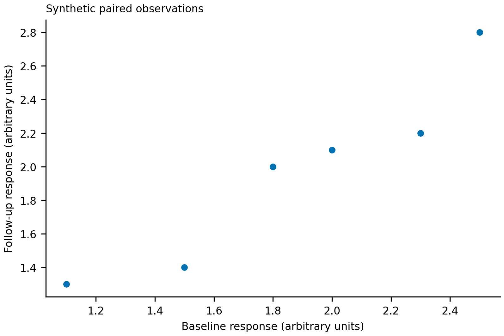

# 期刊论文：让正文、图注和编辑材料讲同一件事

[返回仓库首页](../README.md) · [安装](#安装与运行位置) · [完整教学案例](../skills/prepare-journal-manuscripts/examples/showcase/README.md) · [运行入口](../skills/prepare-journal-manuscripts/SKILL.md)

`prepare-journal-manuscripts` 把期刊正文、图注、统计报告、Data Availability、
cover letter 和返修回复作为一个互相一致的工作来处理。适合已有证据但文章组织不清、
统计单位写错，或正文与编辑材料不一致的任务。

内含 Nature-family 写作指引，但不是“自动生成 Nature 论文”的工具。
实际期刊、文章类型、阶段和当前官方要求决定任务范围；它不会补造发现、作者声明或接收结果。
这份中文教程与英文运行指令分开维护，单独安装一个完整目录即可使用。

## 选择你要完成的任务

| 任务 | 模式 | 主要交付 |
|---|---|---|
| 从已确认问题、方法和结果开始写 | `draft` | 文章提纲、正文、图注和明确的证据缺口 |
| 找到主张、统计报告或跨文件矛盾 | `audit` | 带位置和依据的问题清单 |
| 修改结构、段落和语言 | `polish` | 保留科学内容的修订副本与修改说明 |
| 解释研究与目标期刊的关系 | `cover-letter` | 基于事实的编辑信，不夸大贡献或编作者确认 |
| 核对首次投稿材料 | `editor-pack` | 正文、图、声明、元数据及缺失项的对应清单 |
| 回应编辑与审稿意见 | `revision-response` | 逐条回复、修改位置、clean/marked 版本 |
| 录用后的最终文件 | `final-package` | 实际检查的候选稿和所需制作材料 |
| 期刊政策和文章类型不确定 | `recon` | 当前来源、适用要求和未决信息 |

摘要、[统计报告](../skills/prepare-journal-manuscripts/components/statistics-reporting/guide.md)
与[数据可用性](../skills/prepare-journal-manuscripts/components/data-availability/guide.md)均为本目录内组件，
不是另外安装的技能。写作前先固定研究问题、方法、数据、比较、独立单位、结果及限制；
编辑过程改善解释，不能悄悄改实验协议。

## 准备输入与交付约定

带上具体期刊和文章类型、当前阶段、稿件或批准的提纲、方法及结果来源。
有配对、重复测量或多层样本时，同时提供样本 ID、关系和已采用的统计单位。
图和图注需要 source data、变量含义、聚合方式、不确定性、排除项和实际运行状态，
不能仅凭一张图片反推完整实验设计。

返修还需要原提交版本、完整意见及已完成的新分析。编辑材料需要作者实际确认的作者名单、
伦理、资助、利益冲突、数据存放方式和仓库访问事实；未知项保持未知。

指定新的 revision 目录后，可交付正文、图注、可用性声明、cover letter、审稿回复、
变更清单和渲染后的候选稿。只读任务不写文件；canonical/frozen 原稿不会自动被覆盖。
联系编辑、外部数据存放、投稿系统写入和提交需要另行授权。

## 教学案例：六个配对标本，不是十二个独立样本



场景设定为 AI-for-biology 响应预测研究的**报告排练**，不是已运行的模型或真实生物实验。
[observations.csv](../skills/prepare-journal-manuscripts/examples/showcase/observations.csv)
保留六个标本 ID，每行两个手工构造值。没有真实干预、受试对象或人群抽样。

原句把两次测量数误当成独立样本数，并进一步宣称因果和广泛泛化：

> Twelve independent samples prove that the treatment improves response and generalizes to the wider population.

[修正版](../skills/prepare-journal-manuscripts/examples/showcase/after.md)从记录本身能够支持的描述开始：

> Six constructed specimens each contribute one baseline and one follow-up value.
> Follow-up exceeds baseline for four specimens and is lower for two.

完整案例不是只有一个 PASS：

| 材料 | 你能读到什么 |
|---|---|
| [问题与证据简述](../skills/prepare-journal-manuscripts/examples/showcase/case-brief.md) | AI-biology 背景、输入边界、配对关系与任务请求 |
| [原始片段](../skills/prepare-journal-manuscripts/examples/showcase/before.md) / [修订片段](../skills/prepare-journal-manuscripts/examples/showcase/after.md) | Results、Methods、完整 legend、Data Availability 和 Limitations 如何一致 |
| [编辑材料示例](../skills/prepare-journal-manuscripts/examples/showcase/editorial-response.md) | Cover-note 片段、模拟编辑意见、回应与具体修改位置 |
| [案例教程](../skills/prepare-journal-manuscripts/examples/showcase/README.md) | 推理过程、文件索引、运行步骤、可观察输出与限制 |

这些可读段落和回复是预先编写的教学输出，不是后面的 validator 自动改写，
也不是受控 agent 行为评测记录。检查通过只说明指定字段满足本地检查，不会证明因果结论、
原始样本数、仓库可访问性或期刊接受概率。

## 安装与运行位置

按[仓库安装说明](../README.md#快速开始)获取仓库，将完整
`skills/prepare-journal-manuscripts` 放进 agent runtime 使用的目录，再刷新技能列表。
不要只复制入口。下面默认终端位于仓库根目录：

```bash
SKILL_DIR="$PWD/skills/prepare-journal-manuscripts"
python3 -m pip install -r "$SKILL_DIR/requirements.txt"
```

已经安装到别处的用户，把第一行替换为**实际安装目录的绝对路径**，即包含 `SKILL.md` 的目录。
其他命令保持不变。需要 Python 3.9+；记录检查使用标准库，
数据图使用 `matplotlib==3.9.4`，native PPTX 使用 `python-pptx==1.0.2` 或可用演示工具。
依赖详见 [requirements.txt](../skills/prepare-journal-manuscripts/requirements.txt)。
真实论文/PPTX 渲染器和图像服务是另外的能力，下面的 demo 不需要它们。

## 可运行的小例子

在同一个终端中运行：

```bash
DEMO="$SKILL_DIR/examples/showcase"
DEMO_OUT="$(mktemp -d)"
MPLCONFIGDIR="$DEMO_OUT/.mpl" XDG_CACHE_HOME="$DEMO_OUT/.cache" \
  python3 "$SKILL_DIR/scripts/render_evidence_figure.py" \
  "$DEMO/figure.json" "$DEMO_OUT/figure"
```

预期 exit 0，生成 `$DEMO_OUT/figure.svg`、`figure.pdf`、`figure.png`。
点来自 CSV 的六行；SVG 保留可编辑文字，PDF 为矢量，PNG 为预览。请打开图检查。
新临时目录避免覆盖之前的导出。

下一条**预期失败**，应单独运行，不要放入会遇错退出的连续命令链：

```bash
python3 "$SKILL_DIR/components/statistics-reporting/scripts/validate_analysis_register.py" \
  "$DEMO/analysis-missing-unit.json" --mode final --format markdown
```

预期 exit 1，只有一条 `INDEPENDENT_UNIT` error。再检查完整记录：

```bash
python3 "$SKILL_DIR/components/statistics-reporting/scripts/validate_analysis_register.py" \
  "$DEMO/analysis-complete.json" --mode final --format markdown
```

预期 exit 0，`PASS`、零 errors/warnings。两份记录只在 `independent_unit` 字段是否填入上不同，
因此这个例子只展示缺字段的检查，不宣称自动判断分析是否正确。

最后检查数据清单：

```bash
python3 "$SKILL_DIR/components/data-availability/scripts/validate_data_inventory.py" \
  "$DEMO/data-inventory.json" --mode final --format markdown
```

预期 exit 0，`PASS`、零 errors/warnings。清单指向实际随案例提供的 CSV，
没有声称外部存储或 accession。整个 demo 不做假设检验、不计算区间、不渲染正文，也不生成修订文本。

## 可直接改写使用的任务请求

### 从已有证据起草

```text
使用 $prepare-journal-manuscripts 的 draft 模式。
目标期刊、文章类型、问题、方法、结果和 source data 已附。
先写文章提纲，明确每个 Results 段落由哪个图表支持，
再起草正文和图注。区分细胞数、标本数和独立供体数；
未提供的统计、伦理和数据存放事实不要补写。
在新的 revision 目录交付，不覆盖原始材料。
```

### 修改正文和图注

```text
使用 $prepare-journal-manuscripts 审查并润色现有稿件。
核对 Results、Methods、legends 和 Data Availability 的样本、比较、
不确定性与文件指向是否一致。先报告具体问题，再在副本修订。
保留不利结果；把因果或泛化表述限制在现有设计真正支持的范围内。
```

### 准备 cover letter

```text
使用 $prepare-journal-manuscripts 的 cover-letter 模式。
根据目标期刊、文章类型及已批准的主张，写简洁的编辑信。
说明研究问题、实质贡献和读者关联，不复制夸张摘要。
作者确认、独家投稿、伦理、利益冲突和相关稿件事实只采用我已确认的信息。
缺失项单列，不向编辑发送。
```

### 回复编辑与审稿意见

```text
使用 $prepare-journal-manuscripts 的 revision-response 模式。
逐条对照完整意见、原提交稿和已完成分析，写回应与正文修改位置，
同步 clean/marked 版本。把“已修改表述”“已完成分析”“尚未开展实验”分开。
缺少新证据时明确说明限制，不以措辞代替验证。
```

## 文章组织与图示

内含 [Nature 章节写作](../skills/prepare-journal-manuscripts/references/nature-section-style.md)、
[段落与图注](../skills/prepare-journal-manuscripts/references/nature-paragraphs-and-legends.md)及
[文章形态观察](../skills/prepare-journal-manuscripts/references/nature-family-article-shapes.md)。
它们帮助选择表达方式，不是所有 Nature-family 期刊统一适用的规则或强制写作顺序。

允许制作方法、架构、流程、motivation 或机制示意图时，先实际查看高质量相关示例，
提炼阅读顺序、分组、层次和标签密度，不搬用数据、结论或专有 artwork。
默认 GPT Image 2.5 概念稿后，用当前可用工具直接重建 native editable PPTX；
接口隐藏模型选择时如实报告 backend unknown/unverified。定量面板始终从来源数据绘制。
[本 skill 的独立绘图路线](../skills/prepare-journal-manuscripts/references/standalone-figures.md)
不要求其他技能。复杂多面板任务还可参考[科研绘图指南](scientific-visualizations.md)；
本页散点 demo 不等于已完成 dense Nature figure 或 PPTX 工作流。

## 常见问题

**能只做图注或 Data Availability 吗？** 可以。说明范围，提供图源与实际数据存放事实；
不必为了一个小任务生成完整稿件包。

**没有 p value，需要补一个吗？** 不需要为了格式补统计。先核对问题、设计、独立单位和已运行分析。
本案例明确不做推断；真实研究若缺少必要分析，应报告缺口而不是编造值。

**为什么两个时间点不是两个独立样本？** 在本案例中它们属于同一个标本。
六行代表六个构造标本，十二个测量值不能写成十二个独立标本；真实研究应采用实际依赖结构。

**PASS 是否验证了论文结论？** 没有。validator 检查记录字段，不能替代读原始数据、
判断因果设计、打开仓库或检查最终页面。

**没有渲染器或图像接口？** 完成独立可做的写作和记录检查，列出精确未运行步骤。
不能把未打开的 PDF 称为已检查，也不能把图片嵌进幻灯片称为 native editable PPTX。

**能直接提交吗？** 教学案例不能投稿。真实候选包也仍需当前政策、作者事实、
真实渲染及独立提交授权，不因生成了 cover letter 就得到这些确认。

## 维护与相关指南

按需安装[测试依赖](../requirements-test.txt)，从仓库根目录运行：

```bash
python3 skills/prepare-journal-manuscripts/components/abstract/tests/run_selftest.py
python3 -B -m unittest discover -s tests/journal-manuscripts -p 'test_*.py'
python3 scripts/check_public_content.py .
```

[会议论文指南](conference-manuscripts.md) · [贡献说明](../CONTRIBUTING.md) ·
[维护者](../MAINTAINERS.md) · [第三方条款](../THIRD_PARTY.md) · [Apache-2.0](../LICENSE)
