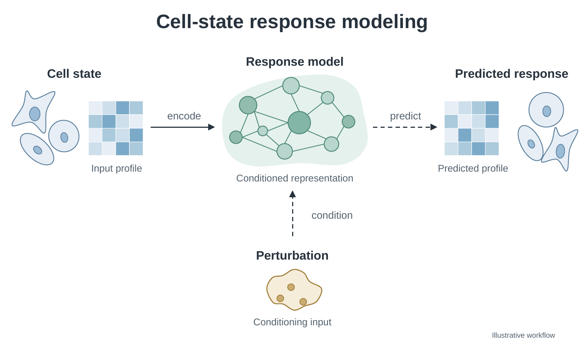
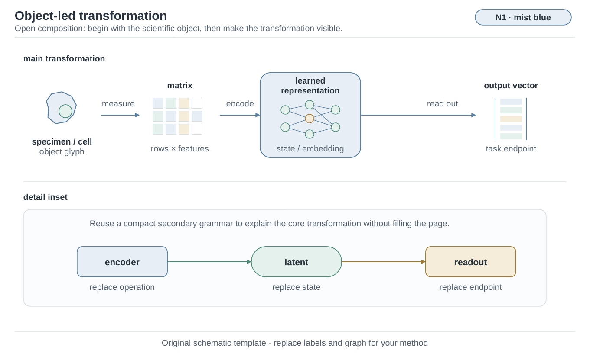
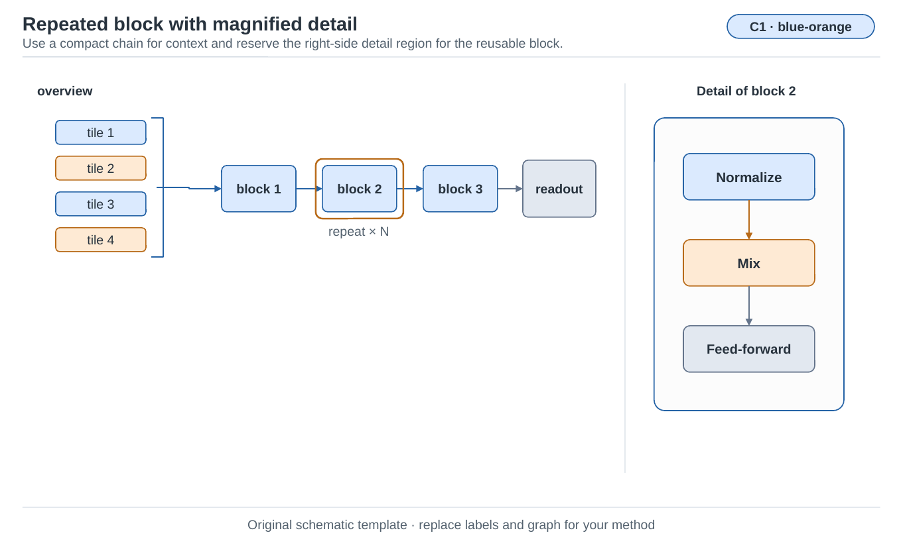

# Scientific Visualizations

[All five skills and repository setup](../README.md)

Build scientific figures from source material: a method diagram, a dense compound
figure, or a coordinated manuscript figure set. This guide covers the
`build-scientific-visualizations` skill, with layout guidance, domain-aware plotting
recipes, editable examples and local rendering/checking tools.

It works independently. You do not need the manuscript or research-workflow skills.
It is not a hosted application, an automatic scientific analyst, or a single command
that turns arbitrary data into a finished Nature paper figure.

[Demos](#demo-gallery) · [Install](#install-and-invoke) ·
[Quick start](#quick-start-render-the-18-panel-demo) ·
[Inputs and outputs](#what-to-provide-and-what-you-get) ·
[Domain recipes](#dense-nature-inspired-and-domain-specific-figures) ·
[Limitations](#limitations-and-common-questions)

## Demo gallery

### Advanced spatial multiomics atlas


A 14-panel composition with a dominant spatial view, linked ROI, molecular profiles,
donor-by-assay heatmap, paired summaries, locus tracks, a null and sensitivity analysis.
Its 12 paired donors and 17,280 cells are entirely synthetic. The visual hierarchy
follows the scientific relationships rather than repeating equal chart boxes.

[Run and adapt the example](../skills/build-scientific-visualizations/examples/spatial-multiomics-atlas/README.md) ·
[Vector PDF](../skills/build-scientific-visualizations/examples/spatial-multiomics-atlas/preview/spatial-multiomics-atlas.pdf) ·
[Editable SVG](../skills/build-scientific-visualizations/examples/spatial-multiomics-atlas/preview/spatial-multiomics-atlas.svg) ·
[Source tables](../skills/build-scientific-visualizations/examples/spatial-multiomics-atlas/data) ·
[Legend](../skills/build-scientific-visualizations/examples/spatial-multiomics-atlas/legend.md)

### Nature-inspired mechanism and sampling hierarchy


Three coordinated panels connect tissue context, paired molecular profiles,
conditioned response modeling and the donor-level comparison unit. Biological
objects, labels and connectors are native editable elements. The diagram is
conceptual and contains no experimental effect sizes.

[Native PPTX](../skills/build-scientific-visualizations/examples/advanced-method-diagrams/nature-spatial-mechanism.pptx) ·
[Vector PDF](../skills/build-scientific-visualizations/examples/advanced-method-diagrams/nature-spatial-mechanism.pdf) ·
[Editable SVG](../skills/build-scientific-visualizations/examples/advanced-method-diagrams/nature-spatial-mechanism.svg)

### Conference-inspired architecture with expanded computation


Separate conditioning streams feed two interaction blocks. The lower detail exposes
attention, residual additions and the feed-forward path; observed response is
restricted to training supervision. This is a fictional teaching architecture,
not a published method or a performance claim.

[Native PPTX](../skills/build-scientific-visualizations/examples/advanced-method-diagrams/conference-conditioning-architecture.pptx) ·
[Vector PDF](../skills/build-scientific-visualizations/examples/advanced-method-diagrams/conference-conditioning-architecture.pdf) ·
[Editable SVG](../skills/build-scientific-visualizations/examples/advanced-method-diagrams/conference-conditioning-architecture.svg) ·
[Editing notes and disclosures](../skills/build-scientific-visualizations/examples/advanced-method-diagrams/README.md)

Both advanced schematics were reconstructed from AI-generated design references,
with no embedded picture in either PPTX. The backend model identity was not exposed.
They demonstrate the concept-to-native route, not certified use of a particular
image-model version or automatic journal-policy compliance.

<details>
<summary>Starter examples, the original 18-panel demo and palette library</summary>

### Dense multi-modal compound figure


An original 18-panel teaching example with five unequal evidence groups, a linked
tissue/ROI view, paired donor summaries, molecular labels and explicit missingness.
All values, cells and coordinates are synthetic; the figure makes no biological claim.

[Run the example](../skills/build-scientific-visualizations/examples/multimodal-18-panel/README.md) ·
[Vector PDF](../skills/build-scientific-visualizations/examples/multimodal-18-panel/preview/multimodal-18-panel.pdf) ·
[Editable SVG](../skills/build-scientific-visualizations/examples/multimodal-18-panel/preview/multimodal-18-panel.svg) ·
[Source tables](../skills/build-scientific-visualizations/examples/multimodal-18-panel/data) ·
[Renderer](../skills/build-scientific-visualizations/examples/multimodal-18-panel/render.py) ·
[Figure legend](../skills/build-scientific-visualizations/examples/multimodal-18-panel/legend.md)

### Native editable method schematic



[Download the native PPTX](../skills/build-scientific-visualizations/assets/design-templates/cell-response-native.pptx)
to edit separate text, shapes and connectors, rather than a flattened image. This
AI-derived conceptual example contains no embedded picture. Its image tool did not
expose the backend model identity, so it does not certify a particular GPT Image
version. Native save/reopen and LibreOffice rendering were checked; Microsoft
PowerPoint GUI editing was not verified.

### Two visual styles, six palettes

| Nature-inspired, object-led flow | Conference-inspired, structured architecture |
|---|---|
|  |  |

[Explore all templates and palettes](../skills/build-scientific-visualizations/references/design-template-library.md) ·
[Download the six-slide editable library](../skills/build-scientific-visualizations/assets/design-templates/diagram-style-library.pptx)

These are original teaching layouts, not official venue templates or empirical
measurements. Recompose the scientific objects and relationships for your method;
changing only the labels is not enough.

</details>

## Capabilities

Its five internal modes cover progressively larger deliverables:

| Mode | Responsibility |
|---|---|
| `layout-sketch` | Disposable hierarchy and reading-order exploration |
| `flowchart` | One workflow, mechanism, method, or architecture diagram |
| `compound-figure` | One complete multi-panel figure or graphical abstract |
| `conference-figure-set` | A coordinated compact figure set for a conference paper |
| `journal-figure-set` | Main, Extended Data, and Supplementary figures for a journal manuscript |

The exact skill directory keeps non-triggering mode guides under `components/` and one
implementation under `shared/figure-core/` for initialization, schema validation, rendering,
vector composition, PDF geometry checks, visual QA, and clean deliverables.

For permitted schematic work, inspect relevant high-quality examples first. Borrow
composition lessons such as reading order, grouping, hierarchy and label density;
do not transfer their scientific claims, data or proprietary artwork.

New or redesigned flowchart, architecture, motivation, method and mechanism schematics
default to GPT Image 2.5 concept generation followed by native editable PPTX
reconstruction in the corresponding conference or journal style. This also applies to
schematic panels within compound figures. See the
[authoring route](../skills/build-scientific-visualizations/references/image-concept-to-vector.md)
for model-identity reporting and small-edit exceptions. Quantitative plots
and measured images remain source-derived; PPTX does not replace required PDF/SVG exports.

## What to provide and what you get

| Provide | Why it matters |
|---|---|
| The figure's question, relevant manuscript passage and draft legend | Establishes the comparison and what the visual may claim |
| Source tables, plotting code, measured images or exact structure files | Keeps quantitative marks and scientific geometry tied to their source |
| Sample/donor linkage, conditions, units, exclusions and existing analysis definitions | Prevents mismatched pairs, invented denominators and misleading uncertainty |
| Target journal/conference, article type, stage and available space | Determines the applicable dimensions, formats and image policy |
| Existing figures or a preferred visual direction, if available | Supports consistent design without treating a reference as scientific evidence |

A normal final handoff contains the requested figure files, editable source, a
self-contained legend, shareable source data and short usage/limitations notes.
Quantitative plots use code and vector PDF/SVG; the default schematic route also
includes native editable PPTX. A sketch-only request produces a sketch, not a
submission-ready figure. Restricted data and private working records are not copied
into public deliverables.

## Install and invoke

Clone `gxCaesar/open-research-skills` once using the [repository setup](../README.md).
From that checkout root, install this skill's dependencies in your selected environment.
The local demo needs no API key, image-generation service or data download.

```bash
python3 -m pip install -r skills/build-scientific-visualizations/requirements.txt
SKILL_DIR="$PWD/skills/build-scientific-visualizations"
```

These shell examples use a POSIX shell. For Windows, activate the environment and set
`SKILL_DIR` using your shell's equivalent commands. Python 3.9 or later is required.

To use the agent skill beyond this demo, copy its entire directory to your agent
runtime's skills location and register that directory using the runtime's normal
mechanism. Replace the destination below and do not overwrite an existing installation:

```bash
cp -R skills/build-scientific-visualizations \
  /path/to/skills/build-scientific-visualizations
```

After copying, set `SKILL_DIR` to the copied directory instead of the checkout:

```bash
SKILL_DIR=/path/to/skills/build-scientific-visualizations
python3 "$SKILL_DIR/shared/figure-core/scripts/init_figure_project.py" --help
```

Keep `SKILL.md`, `components/`, `references/`, `shared/`, `assets/` and `examples/`
together. The repository root and test suite are not runtime installation requirements.

## Quick start: render the 18-panel demo

After the installation above, run from the repository root:

```bash
python3 "$SKILL_DIR/examples/multimodal-18-panel/render.py" \
  --output build/multimodal-demo
```

Open the PDF or PNG in `build/multimodal-demo/`. You should get three files:

```text
build/multimodal-demo/
  multimodal-18-panel.pdf
  multimodal-18-panel.svg
  multimodal-18-panel.png
```

The renderer prints `panels: 18`, `paired_units: 8`, `incomplete_rna_pairs: 0` and
`text_overflows: 0`, along with the font and 183 × 235 mm canvas dimensions. It uses
Arial when installed, otherwise reports DejaVu Sans. Different installed fonts may
change the appearance. Running again into the same directory replaces those three
outputs; choose a new output directory when preserving a version.

This is a direct source-table-to-Matplotlib demonstration, not the full project
workflow, an arbitrary-data plotting API, or an image-to-PPTX demonstration. To
inspect each panel's input, aggregation and meaning, follow the
[walkthrough](../skills/build-scientific-visualizations/examples/multimodal-18-panel/README.md).

## Use it on your own project

Ask your agent to use the installed skill and supply the actual source material. For example:

```text
Use $build-scientific-visualizations in compound-figure mode. Use the attached
donor-level results and tissue images to explain this comparison. Keep donor pairing
and scale bars, propose the whole-page layout first, then deliver the figure,
editable source and legend. Do not change the analysis or add unsupported findings.
```

```text
Use $build-scientific-visualizations in flowchart mode to illustrate the attached
method. Preserve training versus inference dependencies. Deliver the native editable
PPTX and the vector exports needed by the manuscript.
```

```text
Use $build-scientific-visualizations in journal-figure-set mode to coordinate my
main and Extended Data figures. Use the supplied results, keep condition encodings
consistent, and inspect every figure at its intended insertion size.
```

The agent establishes source boundaries, designs the page and checks an actual
render before detailed refinement. Missing data can support a clearly labelled layout
sketch, but cannot be replaced with invented evidence.

For the full local workflow, the shared tools offer separate layout and final phases.
Start with the initializer's help, then follow the selected mode guide in the skill:

```bash
python3 "$SKILL_DIR/shared/figure-core/scripts/init_figure_project.py" --help
python3 "$SKILL_DIR/shared/figure-core/scripts/run_workflow.py" --help
```

Initialization creates a working scaffold, not a completed figure. Populate the
actual sources, venue requirements and page design before running the layout phase;
inspect its proof before the final phase. These scripts do not themselves perform
image generation or native PPTX reconstruction.

Beyond the Python requirements, full PDF conversion/font inspection uses Poppler
commands available on your system. The default
schematic route additionally requires an image-generation capability and a compatible
native presentation capability; the Python tools do not provide either. Prefer GPT
Image 2.5 where selectable. A built-in tool without backend identity can still complete
an authorized default-route request, but its model version must be reported as unverified.

The [design library](../skills/build-scientific-visualizations/references/design-template-library.md)
provides original native-editable examples. Its
[two diagram styles and six palettes](../skills/build-scientific-visualizations/references/diagram-style-profiles.md)
support open, object-led Nature-inspired schematics and structured top-CS-inspired
architectures. New projects can select `--diagram-style` and `--palette`; these are
design presets, not official venue styles or an automatic finished-diagram generator.

Poppler, image generation and a presentation authoring backend are not installed by
the Python requirements file. The skill describes how to use available capabilities;
it does not supply access to a commercial model or install another skill silently.

## Dense Nature-inspired and domain-specific figures

The [dense-page guide](../skills/build-scientific-visualizations/references/dense-compound-design.md)
covers whole-page hierarchy, evidence groups, nested views and actual final-size label
budgets. Routed input-to-panel recipes cover
[spatial and single-cell assays](../skills/build-scientific-visualizations/references/recipes-spatial-single-cell.md),
[proteomics, metabolomics and glycobiology](../skills/build-scientific-visualizations/references/recipes-molecular-omics.md), and
[genomic, structural and clinical views](../skills/build-scientific-visualizations/references/recipes-genomic-structural-clinical.md).
They preserve unit linkage, source-derived geometry, identification status, meaningful
scales, uncertainty, missingness and genuine control comparisons.

For example, the spatial route links a whole-tissue view to ROIs and specimen-level
summaries; the molecular route distinguishes abundance, detection and identification;
the genomic route retains coordinates, reference build and track scales. These are
input-to-display recipes, not automatic replacements for domain-specific analysis.

## Limitations and common questions

**Is this an official Nature template?** No. Nature-inspired design is a visual
direction. Exact journal, article type and submission-stage instructions remain
authoritative. The 18-panel example's teaching canvas does not establish that its
separate long legend fits any particular journal's final page.

**Can I substitute my CSV files directly into the demo?** Not arbitrary study data.
The demo checks its fixed donor population and missingness pattern. For a new study,
adapt the source mapping, panel design, analysis definitions and legend together.

**Why is a font or command missing?** The local plot demo can use DejaVu Sans if Arial
is absent. Full PDF checks additionally need Poppler; schematic authoring needs the
image/presentation capabilities described above. Missing capabilities must be reported,
not replaced with a false claim that a format or model was used.

**Does a passing validator mean the figure is correct?** No. Automated checks cover
declared fields, geometry and selected content risks. They do not establish scientific
validity, resolve all overlaps, or substitute for visual inspection of the final file.

**Can generated images replace microscopy or molecular coordinates?** No. Generated
concepts are for permitted illustrative schematics. Measured images, quantitative plots
and scientific structures must remain source-derived.

**Can I install only the visualization skill?** Yes. Copy its complete directory;
the other skills in this repository are optional. The figure task
still needs the relevant scientific sources and the runtime capabilities it uses.

## Test

From the repository root:

```bash
python3 -B -m unittest discover -s tests/scientific-visualizations -p 'test_*.py'
python3 -B scripts/check_public_content.py .
find skills -type l -print
```

An empty `find` result is expected. Dated geometry profiles are stage-specific engineering
snapshots; current official instructions for the exact journal, article type, and stage take
precedence. Original instructions and code are covered by the repository's Apache-2.0 licence.

## Repository maintenance

Open Research Skills contains five complete entrypoints in one repository. This skill
can still be installed on its own; the other four are optional enhancements. Runtime
dependencies and actual source material remain necessary for the selected task.

See [maintainers](../MAINTAINERS.md), [contributing](../CONTRIBUTING.md), and [third-party terms](../THIRD_PARTY.md). Hosted Linux CI is not configured.

## Related work in this repository

For figure integration, see the [conference](conference-manuscripts.md) or
[journal](journal-manuscripts.md) guide. Those are optional next tasks, not dependencies.
