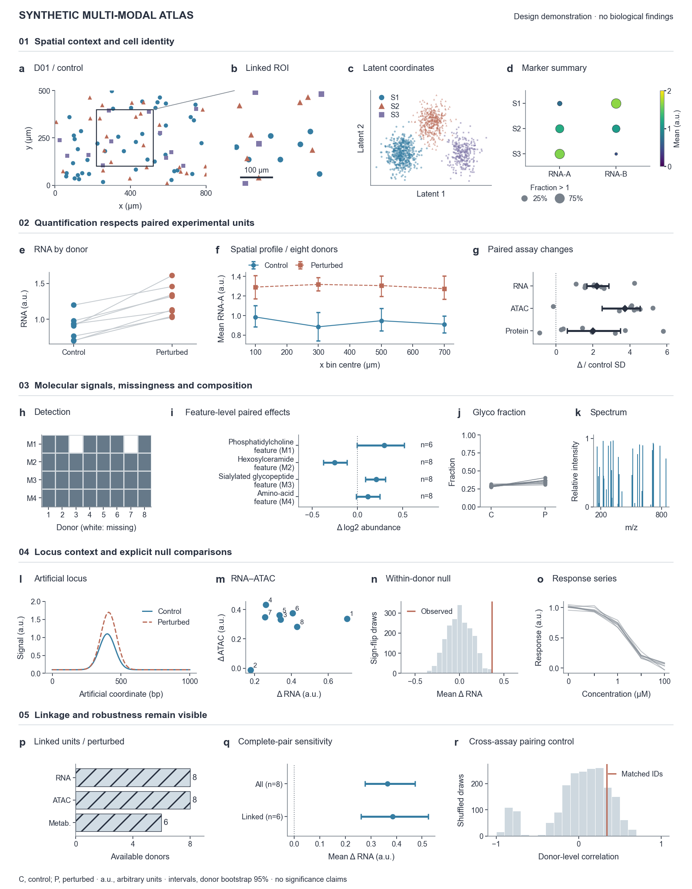

# Original synthetic 18-panel compound figure

This is a runnable visual-construction example, not a biological study, benchmark or
claim of journal acceptance. All 1,280 cells, eight paired donor IDs, assay values,
coordinates, spectra and dose responses are artificial. Several shifts are inserted
by the generator solely to demonstrate different displays; others have small or
variable changes. No measured specimen or molecular identification is represented.

The figure uses five evidence groups with 4 + 3 + 4 + 4 + 3 panels, unequal widths,
a linked ROI, source-aligned cell-state encodings, full multi-line feature names,
explicit missing measurements, complete-pair counts and donor-level uncertainty.
No image generation, account, external data download or companion skill is needed.

[View vector PDF](preview/multimodal-18-panel.pdf) ·
[Edit vector SVG](preview/multimodal-18-panel.svg) ·
[View PNG preview](preview/multimodal-18-panel.png)



## What this demo teaches

| Evidence group | Panels | Design lesson |
|---|---|---|
| Spatial context and cell identity | a–d | Link overview and ROI; keep state colours and marker keys consistent |
| Paired response and spatial profile | e–g | Distinguish donor-level effects from repeated cells and assay scales |
| Molecular measurements | h–k | Make missing measurements, long feature names and illustrative spectra readable |
| Locus context and controls | l–o | Preserve track context, donor correspondence and concentration axes |
| Coverage, uncertainty and controls | p–r | Show sample availability and what a comparison does or does not establish |

The grouping is specific to this example, not a mandatory paper outline. Read
[the legend](legend.md) for the actual quantity and assumptions behind each panel.

## Run from an isolated installation

With the dependencies in the skill's `requirements.txt` installed, copy only the skill
directory to a location of your choice. All scripts and example data stay inside it.

```bash
SKILL_DIR=/path/to/copied/build-scientific-visualizations
python3 "$SKILL_DIR/examples/multimodal-18-panel/render.py" \
  --output /path/to/new-example-output
```

Outputs are `multimodal-18-panel.pdf`, `.svg` and `.png`. PDF/SVG preserve vector
marks and text; PNG is a preview. Arial is used if available; otherwise the renderer
reports DejaVu Sans. `--font` selects an installed font explicitly. The checked-in
preview uses Arial. Edit the Python scene and rerun to change the figure; this
quantitative-only example does not promise native PowerPoint editability.

The terminal summary reports 18 panels, eight paired units, zero incomplete RNA
pairs and zero text items extending outside the page. It also reports the actual
font and dimensions. This output is an engineering summary, not a biological result.
Use a new output directory to preserve earlier renders; an existing output directory
is reused and the three identically named figure files are replaced.

The 183 × 235 mm canvas is an author-selected teaching layout. It is not a final
Nature submission profile and does not demonstrate that its separate long legend fits
on a journal page. Adapt to the exact journal/article/stage and caption allowance.
At reduced insertion width, reallocate panels instead of silently shrinking the type.

The renderer is an intentionally direct Matplotlib example, not a schema-1.2 project
or proof that the separate full workflow was run. Use the normal project contracts
for a real manuscript task. It reuses the installed text-bounds helper, checks actual
drawn text against the page, and keeps the scientific data in six ordinary CSV files.
That check cannot establish intra-panel collision freedom or scientific validity.

## Inputs and generated quantities

| File | Row grain | Used in panels |
|---|---|---|
| `data/cells.csv` | Cell nested in donor and condition; state, coordinates, marker values and artificial latent coordinates | a–d, f |
| `data/assays.csv` | One donor-condition pair member; RNA, ATAC, protein, glyco fraction and assay availability | e, g, j, m, n, p–r |
| `data/molecules.csv` | One donor-condition-feature; blank abundance and `detected=0` mean unmeasured | h, i |
| `data/tracks.csv` | One position in an artificial locus; control and perturbed signal | l |
| `data/spectrum.csv` | One artificial m/z peak and relative intensity | k |
| `data/dose.csv` | Donor-concentration response | o |

`make_data.py` recreates the source tables deterministically into a new directory;
normal rendering reads the supplied CSV files and does not regenerate or overwrite
them. The example's feature names denote artificial feature classes, not identified
molecules. Fractions have a simulated total; they are not site occupancy.

`--data` accepts another copy of this fixed demonstration, not arbitrary study data.
Before drawing, the renderer requires complete RNA, ATAC, protein and glyco-fraction
pairs for D01–D08 and the declared metabolite-availability pattern (D03/D07 absent
only in the perturbed condition). Missing assay values, changed populations or altered
linkage are rejected rather than silently aligning different donors by array position
or retaining incorrect sample-count labels. Adapt the source and legend explicitly
when designing a figure for a different population.

```bash
python3 "$SKILL_DIR/examples/multimodal-18-panel/make_data.py" /path/to/new-synthetic-data
python3 "$SKILL_DIR/examples/multimodal-18-panel/render.py" \
  --data /path/to/new-synthetic-data --output /path/to/new-example-output
```

Read [the figure legend](legend.md) for exact aggregation, standardization and null
construction. Use the example's unequal panel allocation and source-table handling,
not its illustrative perturbation effects or bootstrap recipe as an experimental plan.
